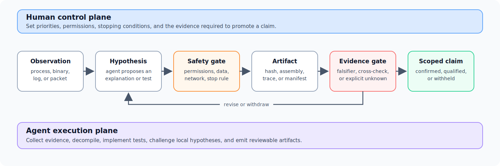

In July 2026, I asked Claude a mundane question: why had AltTab on my Mac
become slow? The debugging session turned into an incident response.

AltTab itself explained only part of the lag. When I added that the menu bar
was also stuttering, Claude widened the process inspection and found a
long-running `osascript`, a root-owned watchdog hidden under an Apple-like
name, and an ad-hoc-signed binary called `AccountsHelper` that the watchdog
relaunched every second. A persistence sweep then found a second implant,
`mdworker_shared`, concealed behind another system-like path.

The first anomaly was surfaced by Claude, not by me and not by antivirus. I
had initiated an ordinary performance investigation; the model recognized
that the evidence no longer looked ordinary. What I did next was to turn that
discovery into a structured investigation: preserve evidence before deleting
anything, define what the agents were and were not allowed to do, choose which
questions mattered, and require every high-impact conclusion to survive a
written evidence standard.

AI agents performed most of the concrete technical work: process inspection,
Ghidra and radare2 analysis, P-code emulation, protocol reconstruction,
verifier implementation, and first drafts of the reports. I designed and led
the investigation plan, with small refinements from the agents; set its
priorities, safety boundaries, decision gates, and acceptance criteria;
initiated the major course corrections; and reviewed what the resulting
artifacts did and did not establish.

The most accurate one-line description is:

> **A human-led, agent-executed, and evidence-corrected investigation.**

This post is about the technical result, but also about a broader AI safety
question: what does useful human oversight look like when agents can execute a
high-stakes investigation faster than their supervisor can independently
reconstruct every step?

## The result in sixty seconds

- **The machine contained two persistent macOS implants.** Static analysis
  confirmed that `AccountsHelper` implemented task polling, one-shot shell
  execution, and an interactive PTY terminal. The second implant was more than
  a clipboard replacer: it routed 26 internal address type codes (one unused),
  replaced recognized addresses, detected wallet secrets, fetched remote
  configuration, and submitted events and secrets to a command server.
- **The core reverse-engineering milestones M0–M5 are complete.** The analysis
  covers both arm64 and x86_64 slices of both universal Mach-O samples. Six
  offline verifiers currently pass, covering frozen hashes, exported
  artifacts, structural invariants, and cross-architecture agreement within
  their documented scopes.
- **The deepest result required recovering strings that ordinary scanning
  could not see.** For the backdoor, isolated interpretation of about twenty
  string-builder functions per architecture recovered an anti-analysis gate,
  18 hidden constants, two command-server bases, and the join/task/terminal
  protocol without executing the Mach-O or contacting its infrastructure.
- **Several plausible early conclusions were wrong.** An Apple logging label
  was mistaken for a domain, system-wide `curl` activity was mistaken for
  malware beaconing, a high-entropy configuration value was mistaken for a
  decryption key, and SYN retransmissions were initially described too
  strongly. The surviving analysis is better because those claims were
  withdrawn or narrowed.
- **The project is not completely finished.** M0–M5 and their reproducible
  analysis bundles are complete. A consolidated evidence matrix, public
  detection package, sanitized release, and final synthesis remain in
  progress. Credential rotation from a clean device is complete; host cleanup
  or replacement is still being closed out.

## Why this is an AI safety project

This is not a benchmark, and one incident cannot establish how agents behave
in general. It is, however, a useful stress test for agent supervision.

The environment was adversarial in three different senses. The binaries were
designed to hide their behavior. The host providing some of the evidence was
itself untrusted. And the agents could produce coherent technical explanations
faster than I could independently reconstruct every step. A fluent but wrong
answer could therefore cause both epistemic and operational harm: deleting
evidence, contacting a live command server, uploading victim-specific data, or
turning an ambiguous trace into an unjustified incident claim.

At the same time, the agents were genuinely capable. They traversed unfamiliar
native binaries, wrote custom analysis tooling, compared architectures, and
kept a multi-stage investigation moving. Treating them as autocomplete would
miss the important part of the case. The challenge was to obtain the benefit
of substantial autonomy without treating autonomy as authority.

That distinction—between *ability to perform work* and *authority to establish
a claim*—became the organizing principle of the project.

## Discovery: an AI-surfaced anomaly

The first useful signal was not a malware signature. It was a mismatch between
the symptom and the process tree.

An `osascript` process was consuming roughly a quarter of a CPU core. Its
parent was a hidden shell loop running as root; the loop repeatedly invoked
`sudo -u` to launch `AccountsHelper` as my user. The directory name imitated an
Apple service, but the binary had an ad-hoc signature, no Apple Team ID, and a
Gatekeeper rejection. Visible strings and imported APIs were consistent with
remote shell behavior. The second persistence chain used the same camouflage
pattern and ran a binary as root.

Neither XProtect nor a later ClamAV scan flagged the samples. I treated those
negative results as evidence about detector coverage, not evidence that the
binaries were benign.

Browser history and filesystem timestamps associate the first installation
window with a malicious Google advertisement that impersonated Claude and led
to a GitLab Pages landing site. A configuration file appeared about thirty
seconds after the visit, followed minutes later by the backdoor and its
persistence mechanism. The exact terminal command or intermediate stager was
not recovered. I therefore describe the malicious-ad chain as strongly
supported, but the precise execution mechanism as unknown; I do not use the
missing step to assign a malware family or operator.

The initial response decision mattered. I chose to preserve hashes, process
state, persistence files, browser evidence, and timestamps before changing
the system or beginning cleanup. I then prioritized three questions:

1. Was there another persistence mechanism or implant beyond the two already
   visible?
2. Could the real command infrastructure and protocol be recovered without
   detonating the samples?
3. Which credentials and data had to be treated as exposed even if historical
   exfiltration could not be proved?

The system sweep found no third implant in the inspected persistence surfaces.
The second and third questions drove the reverse-engineering plan and the
credential rotation that followed.

## My analysis contract for the agents

Before the deep reverse-engineering phase, I wrote the constraints into the
project plan. The important boundaries were:

- do not contact, scan, or probe the real command servers;
- do not execute a complete sample entry point during deep analysis;
- do not upload victim-specific configuration, session values, browser
  history, packet captures, or credentials to CloudLab;
- mount samples read-only and non-executable inside a container with no
  network, dropped capabilities, and `no-new-privileges`;
- prefer isolated function interpretation, with file, process, and network
  effects stubbed, over whole-program execution;
- require separate approval and a new written plan before any dynamic
  execution; and
- never infer that an attacker used a capability merely because the binary
  implements it.

There is an important chronology caveat. Before this stricter protocol was
formalized, an early diagnostic capture had already launched
`AccountsHelper` for twelve seconds on the affected Mac. The script attempted
to block outbound TCP with a named PF anchor. Later review showed that loading
the anchor did not, by itself, demonstrate that it was attached to the active
ruleset. The capture contained repeated SYN packets to the recovered IP, but
no SYN-ACK and no application data.

The defensible conclusion is therefore only that the sample attempted a TCP
connection and did not establish it during the capture. The trace does not
prove that PF caused the failure, and it cannot establish an HTTP path. I do
not hide this mistake behind the later static-only protocol. It is one reason
the deep-analysis plan explicitly rejected reuse of that capture procedure.

### Claims had to pass gates, not just sound plausible

I used four evidence labels throughout the investigation:

| Label | Meaning |
|---|---|
| **Confirmed** | Directly reviewable in assembly, control flow, data flow, or a packet capture |
| **High confidence** | Multiple static observations agree, but one important link remains missing |
| **Inferred** | Consistent with the evidence or a known pattern, but not established by this sample |
| **Unknown** | The available material cannot answer the question |

Decompiler output was a navigation aid, not final evidence. High-impact
claims had to return to assembly or exported data flow. Core logic had to be
checked with another architecture or tool where feasible. Every artifact had
to trace back to a sample hash, tool version, command, and address. When a
claim could not pass its gate, the expected output was not a better story; it
was a narrower claim or an explicit unknown.

This is the part of the project I consider most transferable. Human oversight
did not mean watching every generated command. It meant designing a process in
which the agent's work produced inspectable intermediate objects, while the
right to promote those objects into conclusions remained gated.

[](investigation-loop.svg)

*Figure 1. The human control plane sets permissions and claim thresholds; the
agent execution plane gathers evidence and produces artifacts. Failure at the
evidence gate returns a hypothesis for revision or withdrawal rather than
allowing an unsupported conclusion to pass.*

## Technical deep dive: recovering a hidden command server without detonation

The backdoor's command-server bases did not appear as ordinary ASCII or UTF-16
strings. Straightforward string searches, scans for URL delimiters, XOR
brute-force over the constant section, and naive concatenation of immediate
bytes all failed.

The actual reconstruction chain was:

```text
isolated string-builder P-code
    -> custom hexadecimal text decoding
    -> 256-byte lookup table
    -> XOR keyed by a runtime-derived seed
    -> decoding with a custom 64-character alphabet
    -> plaintext
```

The runtime seed made the anti-analysis code operationally important. The
binary constructed an AppleScript that queried memory and hardware metadata
and checked for virtualization markers. A clean result exited with status
zero; a detected analysis environment exited with status 100. The program
mixed that status into the XOR seed. Under the expected status, all 18 hidden
constants decoded correctly. Under the analysis status, none did. A naive
dynamic run could therefore make the binary look less informative precisely
when it was being inspected.

I chose a static alternative: interpret only the isolated string builders'
Ghidra P-code in a no-network container, with external effects unavailable.
AI agents implemented the byte-level interpreters and produced the initial
reports. I specified and approved the method, required separate arm64 and
x86_64 recovery, kept victim configuration off the remote node, and reviewed
the resulting constants and evidence boundaries.

The two architectures produced byte-for-byte agreement on all 18 constants,
their per-builder XOR offsets, the custom alphabet, and the 3,346-byte
anti-analysis command. The recovered values included two endpoint bases
(defanged here as `45[.]94[.]47[.]204` and `foto[.]gd`), registration and task
paths, terminal markers, local state paths, and protocol tokens. Subsequent
control-flow work closed the loop from task polling to one-shot `/bin/bash -s`
execution and an interactive PTY shell.

Cross-architecture agreement is strong protection against an architecture-
specific disassembly or interpretation mistake. It is not independent malware
authorship evidence: both slices belong to the same universal binary and may
derive from the same source. I use the agreement for the former claim, not the
latter.

The offline M3 verifier checks the exported constants, hashes, structural
invariants, safety metadata, and exact agreement between the two artifact
sets. It does **not** independently rerun the entire P-code recovery. That
means it detects corruption and many classes of inconsistent output, but it
does not turn a generated artifact into an independently reproduced analysis.
The assembly addresses and isolated builder traces remain part of the evidence
chain.

Most importantly, the recovered code establishes capability, not historical
use. It proves that the binary deterministically constructed those endpoints
and implemented remote execution. It does not prove that the server was online
at a particular time, that an operator issued a command, or that a specific
file left my machine.

## The second sample changed the risk assessment

The second implant was initially described as a relatively narrow
cryptocurrency clipboard replacer. M5 forced a more serious conclusion.

Static control flow confirmed a loop that watched the macOS pasteboard every
0.8–1.2 seconds, routed 26 internal address type codes—one of them unused—and
replaced recognized content with built-in or remotely supplied addresses. But
the same loop ran a separate secret detector first. It recognized BIP39-style
word sequences, raw hexadecimal private-key shapes, WIF keys, and several
extended-private-key prefixes. The content-submission path packaged the
clipboard secret together with the name of the frontmost application for
transmission to its command server.

The careful wording here matters. For mnemonic phrases, the code checked word
counts and membership in an embedded 2,048-word list, but I did not find a
BIP39 checksum check. The report therefore says “BIP39-style” rather than
claiming that every captured phrase would be a valid wallet mnemonic.

M5 recovered 63 hidden constants with exact arm64/x86_64 agreement and closed
the client registration, configuration refresh, dynamic replacement, event
reporting, and secret-submission paths. Nineteen opaque arm64 dispatches were
rewritten only inside a temporary Ghidra project so that the decompiler could
recover structure; every original byte range and temporary patch was retained,
and the source Mach-O was not modified.

The final CloudLab evidence archive contains the technical report,
reproduction and cleanup instructions, analysis scripts, manifests, and
static artifacts, but not the sample. The enclosing private workspace still
contains its read-only analysis input and is not a release artifact. The
checksummed archive contains 340 entries. I reran the packaged verifier on the
remote node: it confirmed the 63/63 constant match, the 19 documented
temporary dispatch patches, and 255 manifest-listed files. It did not execute
the sample or contact either recovered endpoint.

This result changed what the incident report had to say. “Clipboard clipper”
understated the component's capability; “cryptocurrency stealer with clipboard
hijacking, wallet-secret collection, remote configuration, and event
reporting” matches the recovered data flow. It still does not prove that a
wallet secret was historically captured or received by an operator.

## The correction ledger

The most informative artifacts in this investigation are not only the
capabilities that were recovered. They are also the claims that did not
survive review.

| Early claim | Why it looked plausible | What harder evidence showed | Final claim | Who initiated the correction |
|---|---|---|---|---|
| `apple.net` was a command-server domain | The fragment appeared hundreds of times in logs | It came from Apple unified-log labels beginning `com.apple.net...` | Not an IOC | I challenged the attribution and required context |
| 2,087 recent `curl` calls were malware beacons | The count was real and appeared bursty | It was a system-wide count that included normal activity, including a Homebrew spike | Not attributable to the sample | I challenged the process attribution |
| The high-entropy `.cfg` value decrypted the command server | Configuration entropy and the missing plaintext host suggested a key | Address-level data flow showed that the first line was sent unchanged as opaque registration material; endpoints were built into the binary | `.cfg` is required bootstrap data, but its server-side meaning is unknown | The agent tested and rejected this local hypothesis during its analysis loop |
| Eight SYN packets represented eight connections, and PF had blocked them | Packet count and the intended firewall setup encouraged a clean story | Sequence numbers and timing showed retransmissions of one attempt; there was no handshake or payload, and the PF attachment was not demonstrated | One attempted TCP connection did not establish; the reason is unknown | Tightened during the evidence audit |

The provenance column is deliberate. I initiated the two early attribution
corrections and the larger demand to return to harder evidence. The agents
also made local corrections inside the bounded investigation, including
disproving the `.cfg` hypothesis. Calling every correction “mine” would erase
evidence that the agent loop was useful; calling the whole process autonomous
would erase the decisions that made its outputs trustworthy enough to use.

After these corrections, I converted the lesson into acceptance criteria:
grade claims, preserve unknowns, require address-level evidence for important
data-flow assertions, compare architectures, and treat self-consistency as
weaker than independent evidence. The goal was to prevent an attractive but
under-supported narrative from reaching the final report, even when neither I
nor the agent noticed the specific error in advance.

## What “reproducible” means here

The core analysis is organized as six completed milestones:

| Milestone | Question answered |
|---|---|
| M0 | Are the two samples, four architecture slices, hashes, and tool versions frozen? |
| M1 | Can the four slices be indexed into conservative function and call maps? |
| M2 | Does the backdoor's control flow close from startup to task execution and terminal access? |
| M3 | Where do its hidden endpoints and bootstrap values come from? |
| M4 | What are the task, acknowledgment, terminal, and cleanup wire semantics? |
| M5 | What does the second implant read, replace, steal, fetch, and report? |

Each milestone exports text, CSV, or JSON artifacts rather than relying only
on a mutable reverse-engineering project. Six offline verifiers—baseline plus
M1 through M5—currently pass. Their job is scoped: they check hashes,
manifests, expected structural facts, cross-architecture equality, and safety
metadata. They are executable specifications for important parts of the
analysis, not independent peer review and not proof that every decompiler
interpretation is correct.

The complete incident repository is not suitable for public release. It
contains live malware, victim-specific configuration, browser evidence,
packet data, and identifying paths. A public artifact should instead include
the plan, sanitized reports, verifier code, manifests, selected static
outputs, and defanged indicators—while excluding binaries, credentials,
session material, raw browser history, and victim-specific captures.

As of July 22, M0–M5 and their internal delivery bundles are complete. The
remaining release work is to consolidate an evidence matrix and unknowns,
write and test stable detection rules, reconcile stale top-level documents,
and build that sanitized public package. This post is therefore a scoped case
study, not a final incident advisory.

## What I learned about supervising capable agents

### Capability and reliability are separate axes

The agents could perform work that would have taken me much longer to execute
manually. That did not make every conclusion reliable. High capability raised
both the ceiling of the investigation and the rate at which a mistaken story
could accumulate supporting-looking detail.

### Self-review is not independent review

An agent that generated a hypothesis could inspect it again and remain
anchored to the same framing. Asking it to “double-check” was weaker than
changing the evidence channel: inspect the log context, trace a value to its
consumer, compare a second architecture, or run a verifier over frozen
artifacts. Review became more useful when disagreement could be grounded in a
different object, not merely another paragraph of reasoning.

### Oversight is a system design problem

The useful human role was not to type every command or approve every harmless
read. It was to define permissions, irreversible-action gates, evidentiary
standards, and stopping rules before the agent reached them. In this case,
that meant no real command-server contact, no victim data on the remote node,
no full-sample execution in the deep phase, and no promotion of a capability
claim into a historical incident claim.

### Uncertainty is a deliverable

The exact initial execution command remains unknown. The packet capture does
not identify why the handshake failed. Static analysis cannot show what the
operator actually did, and the binary alone cannot attribute an organization.
Writing those unknowns down is not an admission that the investigation
failed. It defines the boundary inside which the positive claims are useful.

These lessons connect this project to my [J-space causal
audit](/posts/jspace-cot-tradeoff/). One concerned causal claims about model
internals; the other concerned claims about adversarial software. In both, the
most important research decision was to withdraw an appealing interpretation
after its identification assumptions failed. The common thread is the kind of
work I want to keep doing: building empirical methods that remain trustworthy
when models, tools, or evidence can mislead.

## Limitations

- The browser timeline strongly associates the first installation with a
  malicious advertisement and phishing page, but the exact execution command
  was not recovered.
- The second implant appeared 35 days after a backdoor capable of arbitrary
  shell execution. Delivery through that backdoor is plausible, but not
  established by the available evidence.
- Recovered code demonstrates capability, not historical operator behavior or
  successful exfiltration.
- The packet capture demonstrates an attempted connection that did not
  establish, not an application request and not the cause of failure.
- Cross-architecture agreement reduces several analysis risks, but both
  slices may share source-level bugs or analyst assumptions.
- The current verifiers check exported artifacts and declared invariants; they
  do not independently repeat every reverse-engineering step.
- Detection rules, the consolidated evidence matrix, and the sanitized public
  release remain to be completed before the project should be described as
  fully closed.

## Closing

The tempting story is that an AI agent found and reverse-engineered malware on
its own. That is not what happened, and it is not the lesson I take from the
project.

Claude surfaced an anomaly during a human-initiated debugging session. I then
designed and led an investigation in which AI agents did most of the technical
execution. The work became credible not because the agents were fluent or
autonomous, but because their autonomy was constrained by a safety contract,
externalized into reviewable artifacts, and allowed to fail at the level of a
hypothesis without failing open at the level of a claim.

For capable agents, meaningful oversight is not constant observation. It is a
structure that makes unsafe actions difficult, makes unsupported conclusions
visible, and lets new evidence defeat a coherent story. The recovered malware
capabilities are the concrete result of this project. That structure is the
result I expect to reuse.

---

### Role and acknowledgments

I was the project owner and research decision-maker. I initiated the system
debugging, escalated the anomaly into a formal incident response, designed the
investigation plan and safety protocol, chose the priorities and decision
gates, initiated the major course corrections, reviewed the evidence, and
take responsibility for the claims in this account. Claude and Codex performed
most of the concrete technical execution, including process inspection,
decompilation, analysis scripting, P-code interpretation, artifact generation,
and report drafting; they also proposed small plan refinements and corrected
some local hypotheses. I do not represent AI self-review as independent
validation. Credential rotation and other identity-bound remediation actions
were performed by me from a clean device.

### Artifact status

The private working repository contains raw evidence and live samples and is
not linked here. M0–M5 reports, scripts, manifests, and verifier outputs have
been retained locally; the final M5 archive is also retained and verified on
the isolated CloudLab node. A sanitized artifact release will be linked here
after the evidence matrix, detection package, document reconciliation, and
privacy review are complete.
