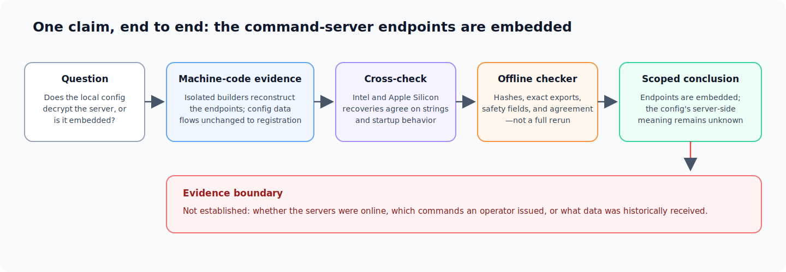

In July 2026, I asked Claude why AltTab on my Mac had become slow. The
debugging session turned into an incident response.

AltTab explained only part of the lag. When I added that the menu bar was also
stuttering, Claude widened the process inspection and found an AppleScript
interpreter consuming unusual CPU, a hidden root-owned watchdog, and a binary
called `AccountsHelper` that the watchdog relaunched every second. A broader
persistence sweep found a second implant concealed behind another
system-looking name.

Claude surfaced the anomaly. I turned it into a structured investigation. I
designed the plan, safety boundaries, decision gates, and evidence standards;
AI agents performed most of the concrete process inspection, reverse
engineering, analysis scripting, and report drafting. That division of labor
is central to this case study.

The technical result matters: we recovered the behavior of a remote-access
backdoor and a cryptocurrency stealer without executing either sample during
the deep-analysis phase. But the more transferable result is a method for
supervising agents when they can produce technical work faster than a human can
independently reconstruct every step.

## The result in thirty seconds

- The first implant implemented remote task polling, one-shot shell execution,
  and an interactive terminal. The second watched the clipboard, replaced
  cryptocurrency addresses, recognized wallet-secret-like content, and
  prepared it for submission to a command server.
- The agents recovered the backdoor's hidden command infrastructure through
  static analysis of both its Intel and Apple Silicon code. The conclusion was
  accepted because saved machine-code evidence, a second architecture, and
  offline checks agreed—not because an agent produced a convincing report.
- Several plausible early claims were wrong. The investigation improved when
  those claims were narrowed or withdrawn, including claims about a supposed
  Apple-related domain, system-wide network activity, a configuration “key,”
  and a packet capture.
- The central lesson is that agent autonomy and authority should be separated:
  agents can gather evidence and test hypotheses, while important claims must
  pass explicit safety and evidence gates.

## From a slowdown to an incident

The first useful signal was not a malware signature. It was a mismatch between
the symptom and the process tree.

The high-CPU AppleScript process belonged to a hidden shell loop running as
root. That loop repeatedly launched `AccountsHelper` as my user. The directory
name imitated an Apple service, but the binary was not signed by a recognized
Apple developer: it had only an ad-hoc signature, no Apple Team ID, and a
Gatekeeper rejection. The second persistence chain used the same camouflage
pattern and ran another binary as root.

Neither XProtect nor a later ClamAV scan flagged the samples. I treated those
negative results as evidence about detector coverage, not evidence that the
binaries were safe.

Browser history and filesystem timestamps strongly associate the first
installation window with a malicious Google advertisement that impersonated
Claude and led to a GitLab Pages site. A configuration file appeared about
thirty seconds after that visit, followed minutes later by the backdoor and
its persistence mechanism. The exact terminal command or intermediate loader
was not recovered, so I do not claim a precise execution mechanism or malware
operator.

My first consequential decision was to preserve hashes, process state,
persistence files, browser evidence, and timestamps before changing the
system. I then prioritized three questions: was there another implant, could
the real command-and-control (C2) protocol be recovered safely, and which
credentials had to be treated as exposed? The inspected startup and
persistence locations showed no third confirmed implant. I rotated high-value
credentials from a clean device and made the C2 question the focus of the
reverse engineering.

## The rules of the investigation

Before the deep-analysis phase, I wrote an investigation contract for the
agents:

- Do not contact, scan, or probe the real C2 infrastructure.
- Do not execute a complete sample entry point; prefer static analysis or
  interpretation of isolated functions with system effects disabled.
- Keep victim-specific configuration, sessions, browser history, packet
  captures, and credentials off the remote analysis node.
- Mount samples read-only and non-executable in a container with no network
  and reduced operating-system privileges.
- Grade important claims as confirmed, high confidence, inferred, or unknown;
  require machine-code or data-flow evidence for high-impact conclusions.
- Use another architecture or analysis tool where feasible, and record sample
  hashes, tool versions, commands, and code addresses.

There was one important exception in the chronology. Before this stricter
contract existed, an early diagnostic capture had launched `AccountsHelper`
for twelve seconds on the affected Mac. The script attempted to block outbound
connections with a macOS packet-filter rule, but the later audit could not
show that the named rule was attached to the active ruleset. The capture showed
repeated copies from one failed connection attempt—the connection never
completed, and there was no application data.

I therefore stopped treating that capture as proof of successful firewall
containment or an HTTP request. The deep-analysis plan explicitly prohibited
reuse of the procedure. This correction is a concrete example of the contract
working as intended: when the safety evidence was weaker than the story, the
claim became narrower and the method changed.

## One claim, end to end: where did the C2 address come from?

This question provides a complete example of the evidence process.

Ordinary string searches found no command-server address in the backdoor. A
high-entropy local configuration file made one early explanation tempting:
perhaps the file was a key that decrypted the server address. Direct attempts
to decode the file or brute-force the binary's constant section did not
support that story.

The useful evidence came from small functions that built strings one byte at a
time. Rather than run the malware, the agents interpreted only those functions
in the reverse-engineering tool Ghidra's architecture-neutral intermediate
representation. External file, process, and network operations were
unavailable. The recovered transformation was:

```text
string-building instructions
    -> custom hexadecimal decoding
    -> table lookup
    -> XOR with a runtime-derived seed
    -> decoding with a custom alphabet
    -> plaintext
```

The runtime seed explained why a naive dynamic analysis could fail. The binary
constructed a hardware check for common virtual-machine markers. Its exit
status changed the XOR seed: the normal path decoded the hidden strings, while
the analysis-detected path produced none of the expected values.

AI agents implemented the byte-level interpreter. I had proposed and approved
the static route, required the two architectures to be recovered separately,
kept victim data off the remote node, and reviewed the claim against the
evidence standard.

The resulting claim can be audited as a chain rather than accepted as prose:

| Stage | What was checked |
|---|---|
| **Claim** | The backdoor embeds two C2 bases; the local configuration value does not decrypt or construct them. |
| **Primary evidence** | Isolated string builders reconstruct the endpoints, while address-level data flow sends the configuration's first line unchanged as registration material. |
| **Cross-check** | Independently analyzed Intel and Apple Silicon machine code produced the same hidden strings and startup behavior. |
| **Offline checker** | A small checking program verifies artifact hashes, expected values, safety metadata, and agreement between the two exported result sets. It does not rerun the full reverse engineering. |
| **Remaining unknowns** | The client alone cannot show whether the servers were online, which commands an operator issued, or what data was historically received. |

The recovered endpoint bases are defanged here as `45[.]94[.]47[.]204` and
`foto[.]gd`. The same evidence set recovered the registration, task-polling,
and interactive-terminal paths. In total, the two architectures agreed on the
set of eighteen hidden strings used by this part of the backdoor.

[](c2-evidence-chain.svg)

*Figure 1. A concrete claim moves from machine code to a static reconstruction,
an architectural cross-check, and a scoped conclusion. The red boundary keeps
unanswered incident questions outside the positive result.*

This example is what “evidence gate” means in practice. The agent's report was
not the terminal object. The terminal object was a claim linked to inspectable
evidence, a different implementation of the same behavior, an automated check
with a stated scope, and a list of unanswered questions.

## The second sample changed the diagnosis

The second implant was initially described as a relatively narrow clipboard
replacer. Deeper static analysis forced a more serious conclusion.

Its main loop watched the macOS clipboard roughly once per second and
recognized many cryptocurrency address formats. Matching addresses could be
replaced by built-in or remotely supplied values. Before replacement, however,
the code ran a separate secret detector. It recognized wallet-recovery-phrase
patterns, raw private-key shapes, WIF keys, and several extended-private-key
prefixes. Here WIF is a standard text format for importing a wallet private
key. Another path packaged the clipboard content together with the name of the
frontmost application for submission to its C2.

The wording was deliberately narrow. For recovery phrases, the code checked
word counts and membership in an embedded word list, but I did not find a
BIP39 checksum check. The report therefore says “BIP39-style” rather than
claiming that every matching phrase would be a valid wallet mnemonic.

The Intel and Apple Silicon analyses agreed on the component's hidden strings
and core control flow. Original instruction ranges and any temporary
decompiler-only modifications were retained so that the readable output could
be checked against unmodified code. That was enough to replace “clipboard
clipper” with a more accurate description: a cryptocurrency stealer combining
clipboard hijacking, wallet-secret collection, remote configuration, and event
reporting.

## The correction ledger

The claims that failed are as informative as the capabilities that survived.

| Initial story | Decisive check | Revised claim | Correction source |
|---|---|---|---|
| `apple.net` was a C2 domain | Read the surrounding unified-log entries | It was part of an Apple logging label, not a domain | I challenged the attribution |
| Thousands of recent command-line network calls (`curl`) were malware beacons | Attribute the count to processes and time-correlated activity | The system-wide count included normal software activity and could not be assigned to the sample | I challenged the attribution |
| The high-entropy configuration value decrypted the C2 | Trace the value from file read to its consumer | It was sent unchanged during registration; the endpoints were embedded elsewhere | The agent rejected this local hypothesis during its analysis loop |
| Several SYN packets proved several connections and successful firewall blocking | Compare sequence numbers, handshake state, and firewall configuration | They were retransmissions of one uncompleted attempt; the cause of failure remained unknown | Tightened during the evidence audit |

The pattern is more important than who noticed each error. A plausible clue
had been promoted into a larger story before its attribution or data flow was
established. The durable response was to make those checks part of the process,
so that future claims did not depend on someone having the same moment of
skepticism again.

## What this taught me about agent oversight

**Autonomy is not authority.** The agents were useful precisely because they
could execute long technical loops, revise local hypotheses, and produce
structured evidence. But permission to perform work was not permission to
decide what the incident record should claim.

**Review should change the evidence channel.** Asking the same agent to
“double-check” can preserve its original framing. Review became more useful
when it meant reading the log context, following a value to its consumer,
comparing another architecture, or checking frozen outputs. A new paragraph of
reasoning was weaker than a new object of evidence.

**Oversight should be designed for failure.** The goal was not to watch every
command. It was to ensure that a failed hypothesis produced a revision, not an
unsafe network action or an overstated conclusion. Permissions, stop rules,
saved intermediate evidence, and explicit unknowns made that possible.

This connects the incident to my [J-space causal
audit](/posts/jspace-cot-tradeoff/). One project concerned claims about model
internals; the other concerned adversarial software. In both, the decisive
research move was to withdraw an appealing interpretation when its identifying
evidence failed. The common theme is building empirical methods that remain
trustworthy when models, tools, or evidence can mislead.

## Scope and project status

The core static analysis is complete for both samples and both architectures,
and the stage-specific offline checks pass. The remaining work is release
engineering: consolidate the evidence matrix and unknowns, write and test
stable detection rules, reconcile stale top-level documents, and build a
sanitized public artifact.

The complete incident repository is intentionally private because it contains
live samples, victim-specific configuration, browser evidence, packet data,
and identifying paths. A public package should contain sanitized reports,
analysis scripts, manifests, selected static outputs, and defanged indicators,
but no binaries, credentials, sessions, raw browser history, or victim-specific
captures.

Several limits remain:

- The malicious-ad timeline is strong, but the exact initial execution command
  was not recovered.
- The second implant appeared after a backdoor capable of shell execution, but
  delivery through that backdoor remains an inference.
- Static analysis and cross-architecture agreement cannot identify the
  operator or reconstruct a complete victim timeline.
- Host cleanup or replacement and the public detection package are still being
  closed out; this is a scoped case study, not a final incident advisory.

## Closing

The easy version of this story is that an AI found and reverse-engineered
malware. The useful version is less cinematic: a capable agent surfaced an
anomaly and performed much of the technical execution inside a human-designed
system of constraints and evidence gates.

The recovered malware behavior is the immediate result. The reusable result is
a way to make agent work auditable: constrain unsafe actions, preserve the
objects behind important claims, seek disagreement through another evidence
channel, and allow uncertainty to survive into the final account.

---

### Role and acknowledgments

I was the project owner and research decision-maker. I initiated the system
debugging, escalated the anomaly into a formal incident response, designed the
investigation plan and safety protocol, chose the priorities and decision
gates, initiated the major course corrections, reviewed the evidence, and
take responsibility for this account. Claude and Codex performed most of the
concrete technical execution, including process inspection, decompilation,
analysis scripting, isolated-function interpretation, saved-evidence
generation, and report drafting. They also proposed small refinements and
corrected local hypotheses. Credential rotation and other identity-bound
remediation actions were performed by me from a clean device.
