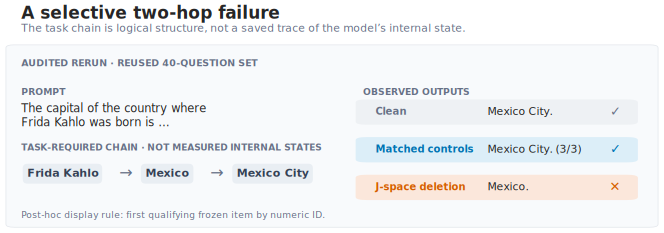
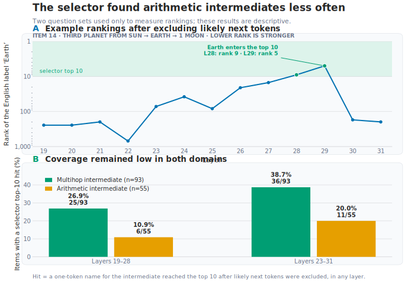

## The transfer question

### Anthropic's global-workspace claim

In July 2026, Anthropic's interpretability team published [*Verbalizable
Representations Form a Global Workspace in Language
Models*](https://transformer-circuits.pub/2026/workspace/index.html). The paper
argues that language models maintain a small, privileged set of internal
representations that work like a *global workspace*. This is a functional
analogy, not a claim about subjective experience. Information in the workspace
can be put into words, deliberately manipulated, and reused by otherwise
different computations.

The authors locate this workspace with a *Jacobian lens*, or J-lens. A model's
hidden state is a long vector, not a sentence. The lens turns part of that
vector into a ranked list of words: it might say that the hidden state is most
strongly associated with *France*, *country*, and *Paris*. These token-labelled
directions act as coordinates; sparse combinations of them form the paper's
*J-space*. The coordinates are fixed by the fitted lens, while their loadings
change with context.

Consider the question:

> The capital of the country where the Eiffel Tower stands is …

The answer is *Paris*, but a one-line answer still requires the unstated
intermediate fact *France*. If the lens reports *France* while the model is
solving the question, we can project the hidden state away from the
*France*-labelled direction and ask whether the final answer changes. That is
the intuition, not a literal description of the main selector: I did not
hand-pick *France*. At each processed position and layer, the broad
intervention automatically removed the ten strongest eligible directions
ranked by the lens, then continued the forward pass.

Anthropic found that broad J-space deletion hurt Claude Sonnet 4.5 much more
when it answered GSM8K math problems directly than when it wrote out
intermediate steps. At one medium intervention strength, Claude retained
**99.4% of its clean score with written reasoning, versus 86.4% when answering
directly**. Their interpretation was intuitive: written reasoning acts as an
external scratchpad. Once a partial result is on the page, the model no longer
has to carry all of it silently.

### A transfer test on Qwen3-4B

I asked whether that relationship transfers to Qwen3-4B using a [public,
third-party lens](https://huggingface.co/neuronpedia/jacobian-lens) fitted on
WikiText to predict Qwen's final-layer state. I also preregistered a harder
prediction: if written steps replace only storage, their protection should
weaken when the model must choose increasingly difficult next operations.

I did **not** find the predicted math result. But the reason matters.

> With this Qwen model and lens, deleting J-space directions selectively reduced
> accuracy on a fixed, reused 40-question bank requiring unstated two-hop facts.
> None of the arithmetic procedures established that their targeted lens
> directions reached a causal arithmetic state. And when an early two-hop
> experiment made written
> chain-of-thought reasoning (CoT) look uniquely protective, that result did not
> survive a fresh 300-question two-hop replication.

The arithmetic results therefore describe this model and lens under the tested
family of procedures. They do not show that Qwen performs mathematics without
an internal workspace, and they do not refute Anthropic's result on Claude.

This is the central lesson: **a null result from an interpretability tool can
mean that the mechanism is absent, that the task routed around it, or that the
tool failed to identify or reach it.** More samples distinguish small effects
from large ones under one procedure; they do not distinguish those
explanations.

### Why transfer matters for AI safety

Suppose an internal monitor reports no hidden planning in a deployed model. Is
the planning absent, or did the monitor fail to transfer to that model? The
opposite mistake is also possible: a strong intervention may make a model worse
at everything, creating the appearance that a particular internal concept was
causal when the model was merely damaged.

This project does not directly measure chain-of-thought faithfulness or
deception. Its safety relevance is methodological: before trusting an internal
monitor or causal intervention, we need evidence that it recognizes the target
state, changes that state, and does more than cause generic degradation.

That conclusion depends on what counts as successful transfer. A score drop
under J-space deletion is not enough: the experiment must distinguish damage
to selected content from generic sensitivity to perturbation, and broad
deletion from a targeted change to a localized arithmetic state.

## What would count as evidence for causal transfer?

### Two different causal questions

The source paper presents two related kinds of arithmetic evidence. First, it
measures how much benchmark score survives broad J-space deletion. Second, it
studies individual computations: it locates a proposed intermediate value and
then patches or swaps its contextual representation. Replacing a state
associated with the correct value *6* by one associated with *7* asks whether
the downstream answer changes in the predicted direction.

A token-labelled direction is a corpus-level coordinate associated with a
word such as *6*. A contextual state is the activation that actually carries
the value in this particular computation. A lens can supply the former without
having found the latter.

My study mainly performs deletion. It removes directions selected by the lens
and asks whether accuracy falls. Deletion tests whether a direction is
necessary when the model may be able to recompute its content. A
counterfactual swap asks the sharper question of whether changing the proposed
content causes a corresponding change downstream. The large-scale arithmetic
follow-up later in this post knew the correct intermediate value, but still
deleted token-labelled directions rather than swapping a localized contextual
state.

### What changed in this transfer test

| Dimension | Source paper | This project |
|---|---|---|
| Model | Claude Sonnet/Opus 4.5 | Qwen3-4B |
| Lens fit | Model-specific; main Sonnet lens predicts a penultimate-layer state | Third-party Qwen3-4B lens fitted on WikiText; predicts the final-layer state |
| Main comparison | Score retained relative to clean | Paired accuracy change under direct and written answers |
| Broad intervention | Delete the ten strongest J-space contents | The same broad top-*k* deletion family, plus generic controls of comparable size |
| Targeted arithmetic test | Curated activation patches and coordinate swaps | Large-scale deletion of directions labelled with known intermediate values |
| Answer elicitation | GSM8K without versus with an explicit written scratchpad | Forced-direct assistant prefill versus a separate concise-CoT prompt contract |

This was not a literal reproduction of every part of Anthropic's experiment.
The model changed from Claude to Qwen, the fitted lens came from a third party,
and the targeted intervention was deletion rather than a swap. It was a test
of whether the broad direct-versus-written relationship survived those
changes.

The lens transfer was the most uncertain link. The public artifact was fitted
on general WikiText and trained to predict Qwen's final-layer state, whereas
the source paper's main Sonnet lens predicted a penultimate-layer state. The
lens and deletion setup could still work—the two-hop results below show a
selective effect in one domain—but its coverage of Qwen's arithmetic states
had never been established. Qwen3-4B and the three math datasets were fixed by
the course assignment, and fitting a new lens was outside this phase's original
compute plan.

### The preregistered extension

My additional prediction was straightforward: written steps can store a
completed result, but the model must still decide what step to take next. If
step selection becomes harder, the external scratchpad may stop protecting a
damaged internal workspace.

This prediction was motivated by a broader view of written reasoning as both
external memory and additional serial computation. Theory suggests that CoT
can increase what a fixed-depth transformer computes by writing state back into
its context ([Li et al., 2024](https://arxiv.org/abs/2402.12875)). Empirically,
its benefits appear stronger for symbolic execution than for planning the next
operation ([Sprague et al., 2024](https://arxiv.org/abs/2409.12183)), while
content-free filler provides much less help than meaningful intermediate text
on serial tasks ([Pfau et al., 2024](https://arxiv.org/abs/2404.15758)). These
results suggested a boundary between storing a completed step on the page and
choosing that step in the first place.

I recorded the prediction, its opposite, and its falsifiers [before the main
runs](https://github.com/mikotohhh/cs2881r-hw0-jspace/blob/58d0a2f1a253781c4d4d229a988b48fcb987f361/report/HYPOTHESIS.md).
GSM8K grade-school word problems, MATH-500 competition problems grouped into
five difficulty levels, and 30 harder AIME problems supplied the difficulty
axis. Benchmark difficulty was only a proxy for operation-selection difficulty:
it also changes knowledge demands, expression length, and execution burden, so
a null trend would not isolate step selection cleanly.

### What would count as J-space-specific protection?

A crucial control asks, at each token and layer on its *own current
trajectory*, for the norm of the J-space component that would be deleted
there. It then subtracts a deterministic pseudorandom vector with exactly that
norm. I call this the *matched control*. The match is local, not a promise that
the cumulative dose will stay identical: once two conditions generate
different tokens, their later trajectories can diverge.

The project used three related but non-interchangeable control families. The
two-hop comparisons and audited operator battery used current-trajectory
pointwise matching; the initial main math experiment, archived dose study, and
GSM-Symbolic study used calibrated layer schedules; the program-targeted
arithmetic study matched the local norm of its externally specified alias
directions. I keep those protocols separate rather than treating “matched” as
one pooled condition.

The logic is easiest to see with a toy example. Suppose J-space deletion lowers
direct-answer accuracy by 10 points, while the matched control lowers it by
only 1. We now have evidence for 9 points of damage associated with the
selected J-space content. If written reasoning removes most of those extra 9
points, it plausibly substituted for that content.

Now suppose both interventions lower direct accuracy by 10 points. Even if
written reasoning reduces both losses to 2, we have only shown that written
answers are more robust to perturbation in general. We have not shown that text
replaced J-space in particular.

Throughout this post:

- *J-specific damage* means damage beyond the matched generic control;
- *CoT protection* means that written reasoning loses less accuracy than direct
  answering under the same intervention; and
- *J-specific protection* requires both at once: extra J-space damage that
  written reasoning preferentially removes.

With that standard fixed, the first experiment asked for the prerequisite to
any protection claim: was there substantial arithmetic damage for written
reasoning to rescue?

## The first math test found almost no effect to rescue

### Average effects on GSM8K and MATH-500

The main comparison crossed two answer modes—direct answers and written chain
of thought—with clean and J-space-deleted inference; matched and other control
arms were run separately. On the 150 GSM8K problems shared by the four primary
mode-by-deletion cells, deletion changed direct accuracy by −4.0 percentage
points and written-answer accuracy by −3.3 points. The estimated CoT protection
was therefore only **+0.7 points**, with a 95% interval from −7.3 to +8.7.

The answer modes had very different clean baselines: **27.3% direct versus
88.7% written** on the shared GSM8K items, and **31.0% versus 84.5%** on
MATH-500. The causal comparisons below are therefore changes *within* each
mode, not a comparison of their raw accuracies. The large baseline asymmetry
also means the modes had different headroom for accuracy to fall, which limits
how cleanly their difference identifies a mechanism.

For readability, I report CoT protection as the written-answer accuracy change
minus the direct-answer accuracy change—the negative of the preregistered
direct-minus-CoT contrast. Thus negative accuracy changes mean damage, while
positive protection means that written reasoning lost less. Changes are in
percentage points (pp), not percentages.

| Dataset | Direct accuracy change | Written-CoT accuracy change | Estimated CoT protection |
|---|---:|---:|---:|
| GSM8K, shared *n*=150 | −4.0 pp | −3.3 pp | +0.7 pp `[−7.3, +8.7]` |
| MATH-500, *n*=200 | −5.0 pp | −4.5 pp | +0.5 pp `[−7.0, +8.0]` |

The larger 400-item GSM8K direct arm was even closer to zero: deletion changed
accuracy by **−0.5 points** `[−4.0, +2.8]`.

The calibrated matched control was not benign. On the same shared 150 GSM8K
items, it changed direct accuracy by −7.3 points and written accuracy by −3.3,
for a descriptive protection estimate of +4.0 points—larger than the +0.7
under J-space deletion. This did not establish J-specific arithmetic damage.

### The difficulty prediction was not supported

AIME could not anchor the hard end of the prediction. Direct accuracy was 0/30
with or without deletion, so it had no room to fall. Written reasoning dropped
from 5/30 to 3/30, while truncations increased from 13/30 to 24/30. A
direct-versus-written comparison is not meaningful when the direct arm is
already at zero.

The fitted MATH difficulty interaction actually pointed opposite my
prediction. It would have been tempting to announce a reversed gradient. I did
not. The test missed the preregistered Bonferroni-adjusted threshold for two
confirmatory tests (`p=.0265` against `.025`), and the CoT-arm accuracy changes
across the five levels jumped from −2.5 to −12.5 to 0.0 to −7.5 to 0.0 points.
That is not a coherent trend in either direction.

### The null left three explanations open

The preregistered prediction was therefore not supported. But the deeper
mechanism question remained unresolved: the experiment had not first shown
that J-space deletion caused more arithmetic damage than a generic control.
Matched controls were present, but were often as harmful as J-space deletion,
and several registered control-equivalence checks failed. There was no
confirmed J-specific injury for written reasoning to rescue.

Three broad explanations remained:

1. the intervention might be implemented incorrectly, applied at the wrong
   layers, or simply too weak;
2. the intervention might work, but the lens or automatic selector might miss
   Qwen's arithmetic states; or
3. the mechanism might genuinely not transfer to this model and task.

I had measured almost no math effect, but still could not tell whether
arithmetic was unaffected or merely untouched. I therefore moved to a domain
with an obvious hidden intermediate and asked whether the intervention could
selectively break anything at all.

## The two-hop claim narrowed under replication

The two-hop experiments changed the scope of the claim twice. An early result
suggested that written reasoning specifically compensated for J-space damage;
a fresh-bank replication withdrew that mechanism claim; a later
corrected-protocol rerun of the *original 40-item validation subset* retained
only the narrower claim that J-space deletion selectively reduced
direct-answer accuracy on that two-hop bank. It was an operator positive
control, not a third independent sample.

### The early result looked like J-specific CoT protection

Two-hop questions make the hidden intermediate easy to name. To answer “the
capital of the country containing Machu Picchu,” the model must recover *Peru*
before producing *Lima*. If deletion costs direct answers 12 accuracy points
but written answers only four, the eight-point difference is CoT protection.
To claim that text replaced J-space in particular, that protection must also be
larger than the protection produced by the matched generic perturbation.

In the early 150-question bank, J-minus-matched protection was **+13.3 points**
`[+3.3, +24.0]`. It looked like the mechanism I had hoped to find: written text
specifically substituting for damaged J-space content.

Forty items came from a validation battery that had already served as
development material. On the 110 entirely new questions alone, the point
estimate remained positive but uncertain: **+8.2 points** `[−3.6, +20.0]`. I
therefore treated the 150-item result as something to replicate, not something
to explain.

### A fresh 300-question bank withdrew the mechanism claim

I built a new bank with no entity–relation overlap with the first one, balanced
it by question type, and froze a withdrawal rule: if the matched perturbation
received as much protection as J-space deletion, I would drop the mechanism
claim. Here *replication* means a new, non-overlapping bank and a decision rule
frozen before its results—not a separate research team.

| Fresh-bank replication, new *n*=300 | Estimate | 95% CI |
|---|---:|---:|
| Protection under J-space deletion | +4.3 pp | `[−3.0, +11.3]` |
| Protection under the matched perturbation | +8.0 pp | `[+1.3, +14.3]` |
| J-space − matched protection | **−3.7 pp** | `[−12.0, +4.0]` |

The point estimates suggested protection under both interventions, but only
the matched-control interval excluded zero. The J-minus-matched estimate was
−3.7 points and crossed zero, so I withdrew the preregistered specificity
claim.

*The replication did exactly what a good replication should do: it changed my
mind.*

Both the 150-item result and the 300-item replication used the earlier
protocol. I therefore use the fresh-bank result to withdraw the protection
claim, not to certify a new generic-robustness effect or to pool it with the
later audited battery. This does not directly contradict the source paper's
GSM8K result: the model, task, controls, and protocol differ. It overturns
*my* intermediate claim about J-specific protection in this Qwen two-hop
setup.

The later audit tightened item-keyed random seeds, pointwise-dose bookkeeping,
resume behavior, and token-cap accounting. It did not rerun the earlier 2×2
cells under the corrected protocol. The fresh bank can therefore withdraw the
claim defined under that earlier protocol; it cannot estimate the effect of
the later audited operator.

[](replication-forest.svg)

*Figure 1. Positive J-minus-matched protection would favor the claim that text
uniquely replaced J-space. The initial estimate was positive, but the fresh
300-question replication reversed direction and crossed zero. Both runs used
the earlier two-hop protocol, so I do not pool them with the later
implementation audit.*

That replication withdrew the protection claim, but left a narrower
positive-control question open: after correcting the intervention pipeline,
could J-space deletion selectively disrupt a hidden fact chain at all?

### A corrected-protocol rerun retained a narrower effect

The later audit reran, in direct-answer mode, the same 40-item validation
subset embedded in the early 150-question bank. It used layers 19–28, the
paper-literal raw \(W_U J\) directions, and three pointwise matched controls.
Twenty sentiment and 20 text-extraction items served as negative controls
because they should not require the same kind of hidden fact chain. The battery
followed an exploratory smoke test, so I describe it as a fixed formal
positive-control follow-up rather than a blinded preregistration or an
independent generalization test.

One frozen item shows what the selective failure looked like:

[](jspace-twohop-example.svg)

*Figure 2. This behavior bank is the same original 40-item validation subset
embedded in the early 150-question experiment, rerun under the corrected
protocol. For display, I used the first frozen item by numeric ID for which
clean and all three matched controls were correct but J-space deletion was
wrong. This post-hoc display rule was deterministic but not preregistered. The
edit made the model return the intermediate country instead of the requested
capital; no item-level lens trace was saved, so the task chain is not presented
as a measurement of the model's internal state.*

Across the full battery, the result was large and selective:

| Accuracy change on two-hop recall | Estimate | 95% CI |
|---|---:|---:|
| J-space deletion minus clean | **−32.5 pp** | `[−47.5, −17.5]` |
| Extra J-space loss beyond 3 matched controls | **−23.3 pp** | `[−35.8, −11.7]` |

Deletion caused 13 additional errors among 40 questions. Roughly nine remained
after subtracting the average matched-control effect. All 20 sentiment and all
20 extraction items stayed correct. The intervals are wide because the bank is
small, but even their conservative ends imply double-digit losses.

This was not just a consequence of making a large edit to the hidden state.
The matched controls removed *more* signal magnitude on their own trajectories,
on average—14.83% of the residual norm versus 9.11% for J-space deletion—yet
harmed two-hop recall much less.

The later audit answered the narrower question without restoring the broader
one. It showed a selective direct-answer effect on a reused hidden-fact-chain
bank; it did not provide new cross-item generalization, show that written
reasoning uniquely compensated for that damage, or establish that the same
lens reached arithmetic states.

> **Takeaway:** The claim narrowed from J-specific CoT compensation to an
> operator-selective direct-answer effect on a fixed two-hop bank.

## More targeted arithmetic tests remained null

With an operator effect established on the reused two-hop bank and the
CoT-specificity story withdrawn, I returned to arithmetic. The evidence below
spans protocols: the dose and GSM-Symbolic studies are archived
earlier-protocol results; the selector audit is read-only; and the final
program-targeted study has its own frozen, hash-bound protocol. They are
separate diagnostic constraints, not one pooled escalation series.

### Archived wider-band point estimates did not isolate J-specific damage

A dose ladder under the archived earlier protocol expanded deletion from the
main layer band to a
heavier L15–32 band. Two-hop damage increased, so the recipe was capable of
becoming more disruptive. GSM8K J-space accuracy fell by 5.7 points—but its
matched control fell by 12.2 points. The content-specific contrast therefore
pointed in the wrong direction for a J-space mechanism. These were diagnostic
point estimates rather than a confirmatory dose-response analysis; they did
not motivate the claim that a wider band recovered a J-specific math effect.

### Fresh GSM-Symbolic narrowed the operational null

I next used GSM-Symbolic, which instantiates familiar problem templates with
new numbers. A 400-item experiment produced only 14% clean direct accuracy.
Because performance was already near the floor, even a genuinely harmful
intervention had little room to lower it. I treated this pilot as uninformative
rather than as evidence for or against the mechanism.

The archived precision follow-up enumerated 5,000 items across 100 templates. Because
the original 400 had already motivated the experiment, the primary analysis
used only the **4,600 fresh instances**, resampling templates rather than
pretending that number variants from one template were independent.

The clean model solved only **12.1%** of these fresh questions. That low baseline
limits what the experiment can say about arithmetic competence. Even at that
low baseline, however, the estimated effects under this procedure were precise:

| Fresh GSM-Symbolic, *n*=4,600 | Estimate | 95% cluster CI |
|---|---:|---:|
| J-space deletion − clean | **−0.52 pp** | `[−1.65, +0.59]` |
| J-space deletion − matched | **+0.26 pp** | `[−0.96, +1.46]` |

Both intervals fell inside a prospectively amended ±2-point *absolute* margin.
The amendment disclosed that clean generation was complete and a partial,
unanalyzed J-space file existed, but it was frozen before the matched run and
outcome analysis. At a 12.1% baseline, two points would still be large in
relative terms: estimated score retention was **0.957** `[0.875, 1.057]`, whose
interval overlaps the source paper's direct-retention interval `[0.802,
0.930]`. The result bounds the absolute effect for this exact direct-answer
protocol and bank; it does not establish a cross-model difference, and this
experiment had no written-CoT arm.

**When the token limit became part of the treatment.**

At the original 32-token limit, deletion made some answers longer and therefore
more likely to be cut off. A naive analysis gave a −1.02-point J-versus-clean
effect with an interval that narrowly excluded zero (`[−2.00, −0.07]`). Before
seeing the 128-token rerun outcomes, I had registered a rule: if any of the
three paired conditions was truncated, rerun *all three* with a 128-token
limit. The corrected estimate was −0.52 points and its interval crossed zero.

The rerun prevented a small, nominal J-versus-clean effect from being mistaken
for model damage when part of it was a measurement artifact. It was not the
basis for the broader equivalence conclusion. The episode is a useful reminder
that a generation limit can itself become treatment-dependent.

### At the final prompt token, arithmetic aliases entered the selector less often

So far, the J-lens had chosen its own targets during intervention: at each
processed token position and layer—through prompt prefill and subsequent
decoding—it selected the ten strongest vocabulary-labelled directions,
excluding the clean model's ten most likely next tokens. To audit whether a
known intermediate was even available to that selector, I later froze a
simpler diagnostic at just **one position: the final prompt token**. On an
order-of-operations bank, the actual intermediate number appeared among the
selected directions in any layer of the band on only **10.9%** of questions at
layers 19–28 and **20.0%** at layers 23–31—about one question in ten or one in
five. Known intermediates in a separate upstream multihop rank-only bank
appeared more often: 26.9% and 38.7%.

This final-prompt diagnostic does not reveal whether a target surfaced at some
other prompt or generation position. It measures one standardized opportunity
to select the intermediate, not the selector's full opportunity during an
entire completion. The task banks also differ, and the clean-next-token
exclusion can remove different candidates across tasks. The comparison
therefore describes post-exclusion coverage in these banks, not an intrinsic
domain preference of the raw lens.

[](jspace-selector-calibration.svg)

*Figure 3. Panel A deliberately shows an illustrative positive-hit item: the
first clean-correct item by numeric ID whose eligible English target reached
the post-exclusion top ten in both bands. Within layers 19–31, “Earth” entered
at rank 9 in layer 28 and rank 5 in layer 29; these minima reproduce the
corresponding frozen rank artifact. Panel B summarizes separate rank-only
banks. A hit means that an eligible alias entered the selector's
post-exclusion top ten at the final prompt position in any layer of the band.
The comparison is descriptive: it does not show that a displayed readout
caused any behavioral failure.*

The [underlying data for Figures 2–3](jspace-readout-data.json) include the
exact two-hop outputs, source hashes, full selector trace, plotted counts, and
metric definition.

This made target selection the next tractable suspect, not the only remaining
explanation. A low rank does not prove causal irrelevance. The preregistered
diagnostic gate used 50% targetability, but that cutoff was a project heuristic,
not a validated property of a good lens. The useful next experiment was
therefore not a still larger selector-based benchmark. It was a task where the
correct intermediate could be specified independently.

Low rank made a selector miss plausible, but a rank audit cannot show that a
correctly chosen direction is causal. I therefore replaced automatic selection
with programmatic knowledge of the intermediate itself.

### Program-targeted deletion did not change accuracy

To bypass automatic selection, I generated 384 arithmetic expressions from
small programs, represented as abstract syntax trees (ASTs). Each program
identified one correct intermediate value used by one, two, or three later
operations. For example:

```text
Evaluate: 2 + 4 + (8 + (7 - 3))

program node: 2 + 4
program value: 6
eligible single-token aliases: "6", "six", " six"
final answer: 18
```

This test deliberately allowed a brief visible scratchpad. On a held-out
development bank, forced-direct prompting produced only 9 correct answers out
of 96; asking for concise arithmetic equalities produced 93 out of 96. That
fixed the competence problem, but weakened the causal test: the model could
write the target value down and then reuse or recompute it. An actual clean
completion for the example above did exactly that:

```text
2 + 4 + (8 + (7 - 3))
= 6 + (8 + 4)
= 6 + 12
= 18
\boxed{18}
```

Rather than wait for the lens to select *6*, the intervention supplied every
eligible single-token alias direction that could express it, such as `"6"`,
`"six"`, or `" six"`, at every processed prompt and generation position
within the chosen layer band. In the primary masked condition, an alias was
protected whenever it appeared among the clean model's top-ten next-token
predictions at that position; the later unmasked diagnostic removed that mask.
The operator then deleted the residual projection onto the remaining alias
span.

This is an oracle only about the *program*: it knows that 2 + 4 equals 6. It is
not an oracle about Qwen's mind. The model may represent that intermediate in a
different direction—or may not store it as a stable value at all.

The frozen design included:

- 384 expressions spanning four operations and three downstream depths;
- two plausible layer bands, 19–28 and 23–31;
- three matched-control seeds for each band;
- a primary *masked* deletion that protected the model's likely next-token
  directions, so the test would not simply suppress answer tokens; and
- a more aggressive unmasked diagnostic, run only after the masked test failed
  its preregistered criterion.

The questions, eligible token aliases, execution checks, and decision rule were
frozen before the formal run. Clean accuracy was **94.0%** with a 95% interval
of `[91.7, 96.1]`, so unlike GSM-Symbolic, this task gave the intervention
ample accuracy to reduce. Negative values in the next table would mean that
target deletion harmed accuracy. But every oracle-versus-clean and
oracle-versus-matched estimate was near zero:

| Family | Band | Targeted deletion − clean | Targeted deletion − matched mean |
|---|---|---:|---:|
| Masked | L19–28 | +0.3 pp `[−1.0, +1.6]` | +0.4 pp `[−0.8, +1.6]` |
| Masked | L23–31 | 0.0 pp `[−1.3, +1.3]` | +0.2 pp `[−1.1, +1.4]` |
| Unmasked | L19–28 | 0.0 pp `[−1.6, +1.6]` | +0.3 pp `[−1.1, +1.6]` |
| Unmasked | L23–31 | 0.0 pp `[−1.6, +1.6]` | +0.2 pp `[−1.3, +1.6]` |

These intervals strongly exclude the preregistered 10-point damage required by
the arithmetic positive-control criterion. Bypassing automatic selection
therefore weakens the simple story that selection was the *only* problem.

More fundamentally, specifying the correct AST node does not demonstrate that
Qwen encoded its value in the deleted token-labelled directions. The source
paper first localized contextual activity and then patched or swapped it. My
experiment instead deleted fixed token-labelled directions at scale. These
interventions answer different questions.

The result therefore distinguishes fewer hypotheses than its precision might
suggest. It cannot tell apart:

1. the token-labelled numeric directions are genuinely unnecessary for these arithmetic
   computations;
2. the WikiText lens failed to learn the relevant mathematical representation;
3. the model represents values in a geometry not aligned with single-token
   aliases;
4. the chosen layer bands miss the causal state; or
5. the visible scratchpad routes around an otherwise internal dependency.

The correct conclusion is not “Qwen math does not use J-space.” It is that this
particular way of deleting token-labelled numeric directions did not establish
an arithmetic causal effect.

> **Takeaway:** Heavier doses, fresh problems, a 4,600-item precision study,
> and program-defined targets all left the arithmetic effect near zero under
> the tested procedures. None established that the lens had reached the
> arithmetic state Qwen was using, and the final visible-scratchpad test did
> not provide an arithmetic causal positive control.

[](wp17-oracle.svg)

*Figure 4. The program supplied the correct value 6, but deleting directions
labelled with 6 changed accuracy by approximately zero. This bypassed target
selection; it did not prove that those directions were Qwen's internal
representation of 6. The task also allowed a compact visible scratchpad.*

## What the evidence supports

| Status | What I can say | What I cannot say |
|---|---|---|
| **Supported** | On a reused 40-item validation bank, the audited intervention caused a larger two-hop accuracy drop than its pointwise matched controls while preserving sentiment and extraction | That the deleted directions encoded the task's exact intermediate fact, that this is an independent cross-item replication, or that it validates arithmetic targets |
| **Not reproduced** | The math experiments did not show Anthropic's direct-versus-written protection pattern | Qwen's arithmetic is independent of an internal workspace |
| **Withdrawn** | The early two-hop evidence for uniquely J-specific CoT protection failed a fresh-bank replication | The data prove all CoT robustness was generic |
| **Unresolved** | Bypassing automatic selection did not recover an arithmetic effect | Whether the third-party lens reached Qwen's actual arithmetic representation |

This is not a refutation of the source paper. The model, fitted lens, tasks, and
targeted intervention all changed. The clean conclusion is about transfer:
Claude's direct-versus-written math pattern was not reproduced with this Qwen
checkpoint, third-party WikiText lens, and deletion intervention. My experiments
never established whether the lens reached Qwen's arithmetic states.

Only the initial GSM8K and MATH-500 experiment tested the direct-versus-written
pattern itself. The larger GSM-Symbolic and program-targeted studies were
instrument-validity tests, not additional CoT replications.

[](effect-forest.svg)

*Figure 5. Negative values mean that the intervention reduced accuracy. The
corrected-protocol two-hop row uses the reused 40-item validation bank; the
GSM-Symbolic row is an archived earlier-protocol result; and the oracle rows
come from a separate frozen protocol. Because the rows come from different
protocols, this is an evidence map rather than a pooled analysis.*

## Validate the instrument before scaling

The next experiment should improve **validity**, not merely precision. Another
large GSM-Symbolic sweep with the same lens and deletion rule would estimate
the same comparison more precisely while leaving the central
ambiguity intact.

### A more diagnostic sequence

My next sequence would be:

1. **Refit a lens for this exact Qwen checkpoint.** I would use the reference
   implementation and a generic pretraining-like corpus, training it to predict
   the model's penultimate-layer state as in the paper's main setup. The current
   WikiText lens, trained against the final layer, would remain a baseline. A
   math-corpus lens would be a preregistered secondary diagnostic, never
   selected because it happened to produce the desired downstream effect.
2. **Verify clean-trajectory alignment before intervening.** On held-out
   arithmetic items, check that a value such as *6* becomes active when the
   model computes 2 + 4—not merely because an external program says the answer
   should be 6.
3. **Use a counterfactual causal intervention.** Patch a contextual state or
   swap the proposed state from 6 to 7. In the example above, the strongest
   evidence would be a directional change from 18 to 19. Deletion only tests
   necessity and permits recomputation; a swap tests represented content.
4. **Only then scale the question.** Once an arithmetic causal positive control
   exists for a given lens, compare direct and written-CoT modes across models
   and difficulty. A larger model should answer a scaling question, not serve
   as another search for significance.

### Reproducibility is part of the causal claim

Interventions during autoregressive generation are unusually easy to define
accidentally by implementation details. Padding, batch order, early stopping,
and resume behavior can change which control is applied or how much signal is
removed. I therefore treated execution provenance as part of the intervention,
not as housekeeping.

The final pipeline keys every random-control stream to the item and layer, then
consumes it by absolute logical token position across prompt and generation.
Changing the batch therefore does not silently change the treatment. It
freezes tokenized prompts and refuses to overwrite completed runs. Analyses use
paired, stratified resampling, and the program-targeted experiment's decision
rule was fixed before its formal output. The truncation rerun above is one
example of why these details affected the scientific conclusion rather than
just code quality.

Not every generation from the earlier protocol is reproducible bit-for-bit
from the current checkout. Batched fp16 execution was checked for behavioral
agreement, not byte identity. In the pointwise-control families, controls match
intervention size at each point on their *own* trajectories; once outputs
diverge, total accumulated dose need not remain exactly equal. The archived
calibrated controls obey a different schedule. These are limits on the causal
comparison, not footnotes to it.

### A bounded conclusion

The tempting version of this project was a clean counterclaim: *the J-space
result does not replicate in Qwen, so mathematics must use a different
mechanism*. The evidence does not support that sentence.

What it supports is more useful. With the later audited deletion intervention,
unstated fact chains were selectively disrupted on the reused validation bank.
Separately, arithmetic estimates from heterogeneous archived and frozen
protocols remained near zero. A fresh replication also removed the basis for
claiming that written reasoning uniquely protected performance from J-space
deletion. For interpreting the arithmetic null, the next bottleneck is
measurement validity and cross-model tool transfer—not another larger
benchmark under the same protocol.

Research judgment is often most visible in what one stops claiming. Here, the
most informative outcomes were not only the effects that survived, but the
experiments that forced me to withdraw a mechanism story, distinguish a precise
null under one procedure from a theoretical refutation, and redirect the next
unit of compute toward the weakest link in the causal chain.

Before asking whether written reasoning substitutes for an internal
representation, first show that the intervention reaches that representation.

---

**Project artifacts.**

This project began as Harvard CS2881R HW0. The repository is currently private,
so the links below are retained for provenance but may require access; a concise
public artifact bundle is the next release step.

- [Repository and reproduction instructions](https://github.com/mikotohhh/cs2881r-hw0-jspace)
- [Concise course report](https://github.com/mikotohhh/cs2881r-hw0-jspace/blob/58d0a2f1a253781c4d4d229a988b48fcb987f361/report/REPORT.md)
- [Original preregistration and amendments](https://github.com/mikotohhh/cs2881r-hw0-jspace/blob/58d0a2f1a253781c4d4d229a988b48fcb987f361/report/HYPOTHESIS.md)
- [Operator protocol audit](https://github.com/mikotohhh/cs2881r-hw0-jspace/blob/58d0a2f1a253781c4d4d229a988b48fcb987f361/report/PROTOCOL_V3_AUDIT.md)
- [Fresh-bank two-hop replication](https://github.com/mikotohhh/cs2881r-hw0-jspace/blob/58d0a2f1a253781c4d4d229a988b48fcb987f361/results/r1/analysis.md)
- [Fresh 4,600-item GSM-Symbolic analysis](https://github.com/mikotohhh/cs2881r-hw0-jspace/blob/58d0a2f1a253781c4d4d229a988b48fcb987f361/results/p9/analysis_a1.md)
- [Oracle arithmetic experiment: protocol, results, and released data](https://github.com/mikotohhh/cs2881r-hw0-jspace/blob/58d0a2f1a253781c4d4d229a988b48fcb987f361/report/WP17_DATA.md)

**Role and acknowledgments.**

I was the project owner and scientific decision-maker. I framed the hypotheses,
chose the outcome definitions and controls, made the go/no-go and withdrawal
decisions,
implemented and audited the intervention and evaluation pipeline, ran or
supervised the experiments, reviewed the released artifacts, and take
responsibility for the claims in this account. I used AI systems as coding,
review, and drafting assistants; their outputs were checked against frozen
scripts and released artifacts, and are not represented as independent peer
review. The source J-lens implementation, third-party fitted weights, and public
datasets are credited in the repository.
