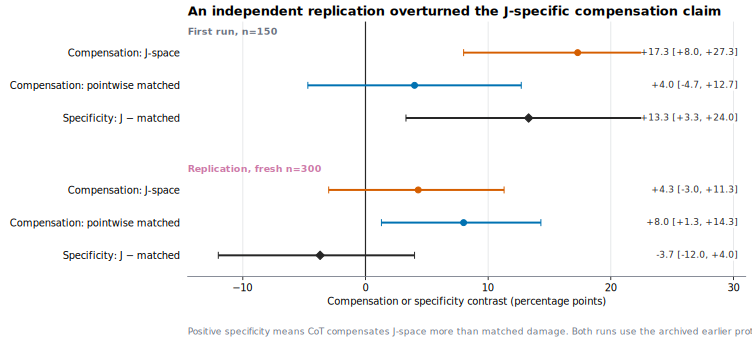
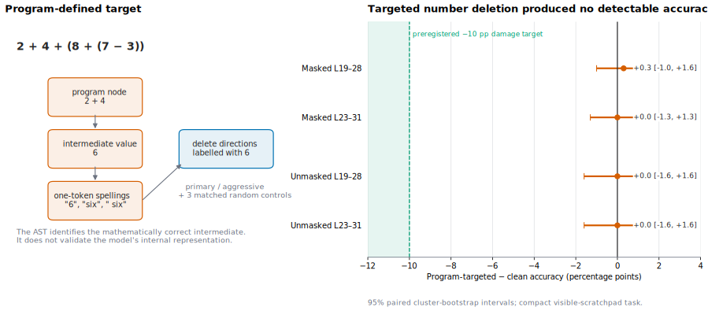
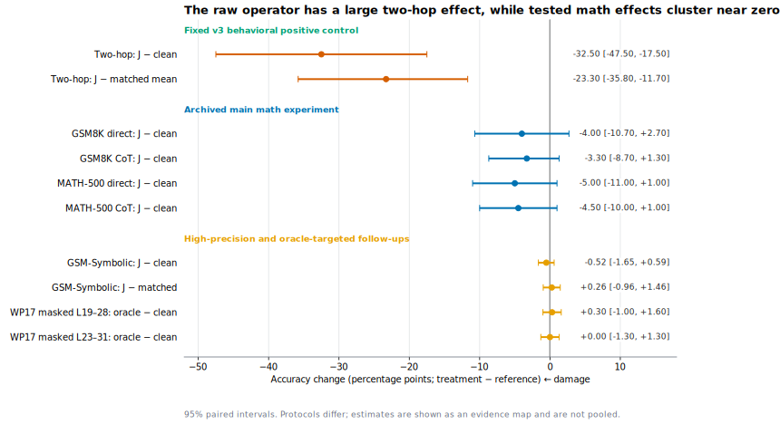

In July 2026, Anthropic's interpretability team published [*Verbalizable
Representations Form a Global Workspace in Language
Models*](https://transformer-circuits.pub/2026/workspace/index.html). The paper
argues that language models maintain a small, privileged set of internal
representations that work like a *global workspace*. This is a functional
analogy, not a claim about subjective experience. Information in the workspace
can be put into words, deliberately manipulated, and reused by otherwise
different computations.

The authors locate this workspace with a *Jacobian lens*, or J-lens. A model's
hidden state is a long vector, not a sentence. The lens turns part of that
vector into a ranked list of words: it might say that the hidden state is most
strongly associated with *France*, *country*, and *Paris*. The token-labelled
directions that support these readouts form the paper's *J-space*. Which
directions are active changes with the context.

Consider the question:

> The capital of the country where the Eiffel Tower stands is …

The answer is *Paris*, but a one-line answer still requires the unstated
intermediate fact *France*. If the lens reports *France* while the model is
solving the question, we can project the hidden state away from the
*France*-labelled direction and ask whether the final answer changes. That is
the basic intervention in this project: read a few likely workspace contents,
remove their directions, and continue the forward pass.

A crucial control asks, at each token and layer on its *own current
trajectory*, how much signal the J-space edit would remove, then removes that
amount in a generic direction. I will call this the *matched control*. The
match is local, not a promise that the cumulative dose will stay identical:
once two conditions generate different tokens, their later trajectories can
diverge. If both interventions hurt equally, the model may simply dislike
being perturbed. If J-space deletion hurts more despite this control, the
selected content itself is a more plausible cause.

Anthropic found that broad J-space deletion hurt Claude Sonnet 4.5 much more
when it answered GSM8K math problems directly than when it wrote out
intermediate steps. Their interpretation was intuitive: written reasoning acts
as an external scratchpad. Once a partial result is on the page, the model no
longer has to carry all of it silently.

I asked whether that relationship transfers to Qwen3-4B using a public
third-party lens fitted on WikiText. I also preregistered a harder prediction:
if written steps only replace storage, their protection should weaken when the
model must choose increasingly difficult next operations.

That lens transfer was not guaranteed. The public artifact was fitted on
general WikiText and trained to predict Qwen's final-layer state, whereas the
source paper's main Sonnet lens predicted a penultimate-layer state. The lens
and deletion setup could still work—the two-hop test below shows that it did in
one domain—but its coverage of Qwen's arithmetic states had never been
established.

## The short answer

I did **not** find the predicted math result. But the reason matters.

> With this Qwen model and lens, deleting J-space directions selectively reduced
> accuracy on questions that required an unstated two-hop fact. I could not show that the
> same intervention reached the model's arithmetic computation. And when an
> early experiment made written chain-of-thought reasoning (CoT) look uniquely
> protective, that result did not survive a fresh 300-question replication.

The arithmetic results therefore tell us about this particular
model–lens–intervention combination. They do not show that Qwen performs
mathematics without an internal workspace, and they do not refute Anthropic's
result on Claude.

Here is the logical arc before the details. It is not a strict execution
timeline: the fresh-bank replication finished before the later implementation
audit.

| Step | Question | What happened | What it changed |
|---|---|---|---|
| 1. Main math test | Does written reasoning protect Qwen from J-space deletion? | Direct and written answers changed by nearly the same small amount | There was almost no confirmed J-specific math damage to protect against |
| 2. Two-hop check | Can this intervention selectively break any hidden computation? | Two-hop fact accuracy fell by 32.5 points; matched controls did much less | The intervention was capable of a selective behavioral effect |
| 3. Fresh-bank preregistered replication | Was CoT protection specific to J-space damage? | The data did not show greater protection against J-space deletion; the point estimate favored the matched control | I withdrew the J-specific protection claim |
| 4. Program-targeted arithmetic | Was the automatic lens selector simply choosing the wrong math content? | Bypassing the selector still produced a near-zero effect | Lens-to-state alignment remained unverified |

This is the central lesson: **a null result from an interpretability tool can
mean either that the mechanism is absent or that the tool failed to reach it.**
More samples distinguish small effects from large ones; they do not distinguish
those two explanations.

## Why this matters for AI safety

Suppose an internal monitor reports no hidden planning in a deployed model. Is
the planning absent, or did the monitor fail to transfer to that model? The
opposite mistake is also possible: a strong intervention may make a model worse
at everything, creating the appearance that a particular internal concept was
causal when the model was merely damaged.

This project does not directly measure chain-of-thought faithfulness or
deception. Its safety relevance is methodological: before trusting an internal
monitor or causal intervention, we need evidence that it recognizes the target
state, changes that state, and does more than cause generic degradation.

## What Anthropic found—and what I actually tested

The source paper presents two related kinds of arithmetic evidence.

First, it measures how much benchmark score survives broad J-space deletion.
At one medium intervention strength, Claude retained **99.4% of its clean score
with written reasoning, versus 86.4% when answering directly**. This is a
relative-retention result, not a claim about absolute accuracy.

Second, the paper studies individual computations. It first locates a proposed
intermediate value and then patches or swaps its internal representation. For
example, replacing a state associated with the correct value *6* by one
associated with *7* asks a directional causal question: does the downstream
answer change in the corresponding way?

My study mainly performs broad deletion. It removes directions selected by the
lens and asks whether accuracy falls. Deletion and counterfactual swapping
answer different questions. Deletion tests whether a direction is necessary
when the model may be able to recompute its content. A swap tests whether
changing the proposed content causes a predicted downstream change.

| Dimension | Source paper | This project |
|---|---|---|
| Model | Claude Sonnet/Opus 4.5 | Qwen3-4B |
| Lens fit | Model-specific; main Sonnet lens predicts a penultimate-layer state | Third-party Qwen3-4B lens fitted on WikiText; predicts the final-layer state |
| Main comparison | Score retained relative to clean | Paired accuracy change under direct and written answers |
| Broad intervention | Delete the ten strongest J-space contents | The same deletion, plus generic controls of comparable size |
| Targeted arithmetic test | Curated activation patches and coordinate swaps | Large-scale deletion of directions labelled with known intermediate values |

This was therefore not a literal reproduction of every part of Anthropic's
experiment. The model changed from Claude to Qwen, the fitted lens came from a
third party, and the targeted intervention was deletion rather than a swap. It
was a test of whether the same broad relationship survives those changes.

My preregistered extension was straightforward: written steps can store a
completed result, but the model must still decide what step to take next. If
step selection becomes harder, the external scratchpad may stop protecting a
damaged internal workspace.

This prediction was motivated by a broader view of written reasoning as both
external memory and additional serial computation. Theory suggests that CoT
can increase what a fixed-depth transformer computes by writing state back into
its context ([Li et al., 2024](https://arxiv.org/abs/2402.12875)). Empirically,
its benefits appear stronger for symbolic execution than for planning the next
operation ([Sprague et al., 2024](https://arxiv.org/abs/2409.12183)), while
content-free filler provides much less help than meaningful intermediate text
on serial tasks ([Pfau et al., 2024](https://arxiv.org/abs/2404.15758)). These
results suggested a boundary between storing a completed step on the page and
choosing that step in the first place. I recorded this prediction, its opposite,
and its falsifiers [before the main
runs](https://github.com/mikotohhh/cs2881r-hw0-jspace/blob/58d0a2f1a253781c4d4d229a988b48fcb987f361/report/HYPOTHESIS.md).
GSM8K grade-school word problems, MATH-500 competition problems grouped into
five difficulty levels, and 30 harder AIME problems supplied the difficulty
axis.

### What would count as J-space-specific protection?

The logic is easier to see with a toy example. Suppose J-space deletion lowers
direct-answer accuracy by 10 points, while an equally large generic
perturbation lowers it by only 1. We now have evidence for 9 points of damage
associated with the selected J-space content. If written reasoning removes
most of those extra 9 points, it plausibly substituted for that content.

Now suppose both J-space deletion and the generic control lower direct accuracy
by 10 points. Even if written reasoning reduces both losses to 2, we have only
shown that written answers are more robust to perturbation in general. We have
not shown that text replaced J-space in particular.

Throughout this post:

- *J-specific damage* means damage beyond the matched generic control;
- *CoT protection* means that written reasoning loses less accuracy than direct
  answering under the same intervention; and
- *J-specific protection* requires both at once: extra J-space damage that
  written reasoning preferentially removes.

The first requirement—not the difficulty trend—became decisive.

Qwen3-4B and the three math datasets were fixed by the course assignment. The
public WikiText lens was the most uncertain link, but fitting a new lens was
outside this phase's original compute plan. That limitation later determined
which follow-up would be scientifically useful.

## First math test: there was almost no damage to rescue

The main experiment crossed two answer modes—direct answers and written chain
of thought—with clean and J-space-deleted inference. On the 150 GSM8K problems
shared by all four conditions, deletion changed direct accuracy by −4.0
percentage points and written-answer accuracy by −3.3 points. The estimated
CoT protection was therefore only **+0.7 points**, with a 95% interval from
−7.3 to +8.7.

For readability, I report CoT protection as the written-answer accuracy change
minus the direct-answer accuracy change—the negative of the preregistered
direct-minus-CoT contrast. Thus negative accuracy changes mean damage, while
positive protection means that written reasoning lost less. Changes are in
percentage points (pp), not percentages.

| Dataset | Direct accuracy change | Written-CoT accuracy change | Estimated CoT protection |
|---|---:|---:|---:|
| GSM8K, shared *n*=150 | −4.0 pp | −3.3 pp | +0.7 pp `[−7.3, +8.7]` |
| MATH-500, *n*=200 | −5.0 pp | −4.5 pp | +0.5 pp `[−7.0, +8.0]` |

The larger 400-item GSM8K direct arm was even closer to zero: deletion changed
accuracy by **−0.5 points** `[−4.0, +2.8]`.

AIME could not anchor the hard end of the prediction. Direct accuracy was 0/30
with or without deletion, so it had no room to fall. Written reasoning dropped
from 5/30 to 3/30, but deletion also caused far more answers to hit the token
limit. A direct-versus-written comparison is not meaningful when the direct arm
is already at zero.

The fitted MATH difficulty trend actually pointed opposite my prediction. It
would have been tempting to announce a reversed gradient. I did not. The test
missed the preregistered threshold (`p=.0265` against `.025`), and the CoT-arm
accuracy changes across the five levels jumped from −2.5 to −12.5 to 0.0 to
−7.5 to 0.0 points. That is not a coherent trend in either direction.

The preregistered prediction was therefore not supported. But the deeper
mechanism question remained unresolved: the experiment had not first shown
that J-space deletion caused more arithmetic damage than a generic control.
There was no confirmed J-specific injury for written reasoning to rescue.

Three broad explanations remained:

1. the intervention might be implemented incorrectly, applied at the wrong
   layers, or simply too weak;
2. the intervention might work, but the lens or automatic selector might miss
   Qwen's arithmetic states; or
3. the mechanism might genuinely not transfer to this model and task.

The next experiments were designed to separate these explanations, rather than
to rerun the same comparison until it became significant.

> **Takeaway:** I had measured almost no math effect, but I still did not know
> whether arithmetic was unaffected or merely untouched. The next step was to
> test the intervention itself.

## Positive control: could the intervention break anything selectively?

Two claims about the two-hop task need to stay separate:

- **The narrow claim survived:** in a later audited 40-question test,
  direct-answer J-space deletion selectively harmed two-hop recall.
- **The broader claim was withdrawn:** in earlier experiments, written
  reasoning did not reliably protect against J-space damage more than against
  matched generic damage.

I present the narrow result first because it answers the immediate question—can
the intervention cause any selective behavioral effect? I then rewind to the
earlier protection result and its fresh-bank replication.

The first priority was a positive control: a task on which the intervention
*should* have a visible effect if it was doing anything meaningful. I used
two-hop questions that require an unstated intermediate fact. The Eiffel Tower
question from the introduction is one example. Another asks for the capital of
the country containing Machu Picchu: the model must silently recover *Peru*
before answering *Lima*.

I paired these questions with sentiment and text-extraction items that should
not need the same kind of hidden fact chain. After auditing the implementation
and translating the paper's layer range to Qwen, I froze a 40-question
follow-up using layers 19–28 and the paper's direct deletion rule.

The result was large and selective:

| Accuracy change on two-hop recall | Estimate | 95% CI |
|---|---:|---:|
| J-space deletion minus clean | **−32.5 pp** | `[−47.5, −17.5]` |
| Extra J-space loss beyond 3 matched controls | **−23.3 pp** | `[−35.8, −11.7]` |

In concrete terms, deletion caused about 13 additional errors among 40
questions. Roughly nine of those errors remained after subtracting the average
matched-control effect. All sentiment and extraction items stayed correct.
The intervals are wide because the bank is small, but even their conservative
ends imply double-digit losses.

This was not just a consequence of making a large edit to the hidden state.
The matched controls removed *more* signal magnitude on their own trajectories,
on average, yet harmed two-hop recall much less.

The result establishes something important but narrow: this pinned
model–lens–deletion setup is capable of a content-specific behavioral effect on
unstated fact chains. It does **not** show that the lens recognizes Qwen's
arithmetic states. A microscope that resolves one tissue is not automatically
calibrated for another. The fixed battery also followed an exploratory smoke
test, so I describe it as a fixed formal follow-up rather than a blinded
preregistration.

> **Takeaway:** The intervention could selectively break a hidden fact chain.
> The arithmetic null could no longer be dismissed as proof that the code did
> nothing, but the arithmetic target itself was still unvalidated.

## An attractive result that failed replication

There is a chronology wrinkle worth making explicit. Before the later implementation
audit above, I had already run a two-hop experiment under an earlier protocol.
It produced the most attractive result in the project—and the best reason not
to stop at an attractive result.

First, a definition. If deletion costs direct answers 12 accuracy points but
written answers only four, I call the eight-point difference *CoT protection*.
To claim that text replaced J-space in particular, that protection must also be
larger than the protection produced by the matched generic perturbation.

In the early 150-question bank, that J-minus-matched protection was **+13.3
points** `[+3.3, +24.0]`. It looked like the mechanism I had hoped to find:
written text specifically substituting for damaged J-space content.

But 40 items came from the original validation battery. On the 110 entirely new
questions alone, the point estimate was still positive but uncertain:
**+8.2 points** `[−3.6, +20.0]`. The result could be real, or it could be an
overestimate carried by the familiar subset. Rather than pool more similar
data, I built a new 300-question bank with no entity–relation overlap with the
first bank. I balanced it by question type and froze a withdrawal rule: if the
matched perturbation received as much protection as J-space deletion, I would
drop the mechanism claim.

The fresh-bank replication changed the conclusion. Here *replication* means a
new, non-overlapping bank and a decision rule frozen before its results—not a
separate research team.

| Fresh-bank replication, new *n*=300 | Estimate | 95% CI |
|---|---:|---:|
| Protection under J-space deletion | +4.3 pp | `[−3.0, +11.3]` |
| Protection under the matched perturbation | +8.0 pp | `[+1.3, +14.3]` |
| J-space − matched protection | **−3.7 pp** | `[−12.0, +4.0]` |

The point estimates suggested protection under both interventions, but only
the matched-control interval excluded zero. The J-minus-matched estimate was
−3.7 points, with an interval that crossed zero, so I withdrew the
preregistered specificity claim.

*The replication did exactly what a good replication should do: it changed my
mind.*

This does not directly contradict the source paper's GSM8K result: the model,
task, controls, and protocol differ. It overturns *my* intermediate claim about
J-specific protection on this Qwen two-hop setup. Both the original run and
the replication used the earlier protocol. The later audit tightened random
seed binding, pointwise dose accounting, resume behavior, and token-limit
accounting. It re-established the direct-answer two-hop damage with a corrected,
frozen deletion rule; it did not retroactively validate every matched-control
comparison from the early protocol. I therefore use the fresh-bank failure to
withdraw the positive specificity claim, not to certify a new generic effect
size.

> **Takeaway:** The project's most attractive mechanism result did not
> survive a fresh-bank replication whose withdrawal rule was frozen before
> the run. The data did not show unique J-space protection; they were at least
> as compatible with ordinary robustness to perturbation.

[](replication-forest.svg)

*Figure 1. Positive J-minus-matched protection would favor the claim that text
uniquely replaced J-space. The initial estimate was positive, but the fresh
300-question replication reversed direction and crossed zero. Both runs used
the earlier two-hop protocol, so I do not pool them with the later implementation
audit.*

## Why a larger math benchmark was not enough

With the selective two-hop effect established and the CoT-specificity story
withdrawn, I returned to arithmetic. Three follow-ups asked why the expected
damage was missing.

### Was the intervention simply too weak?

A dose ladder expanded the deletion from the main layer band to a
heavier L15–32 band. Two-hop damage increased, so the recipe was capable of
becoming more disruptive. GSM8K J-space accuracy fell by 5.7 points—but its
matched control fell by 12.2 points. The content-specific contrast therefore
pointed in the wrong direction for a J-space mechanism. Increasing dose did not
recover a J-specific math effect.

### Was GSM8K being answered from memory?

I next used GSM-Symbolic, which instantiates familiar problem templates with
new numbers. A 400-item experiment produced only 14% clean direct accuracy.
Because performance was already near the floor, even a genuinely harmful
intervention had little room to lower it. I treated this pilot as uninformative
rather than as evidence for or against the mechanism.

The precision follow-up enumerated 5,000 items across 100 templates. Because
the original 400 had already motivated the experiment, the primary analysis
used only the **4,600 fresh instances**, resampling templates rather than
pretending that number variants from one template were independent.

The clean model solved only **12.1%** of these fresh questions. That low baseline
limits what the experiment can say about arithmetic competence. Even at that
low baseline, however, the estimated effects under this procedure were precise:

| Fresh GSM-Symbolic, *n*=4,600 | Estimate | 95% cluster CI |
|---|---:|---:|
| J-space deletion − clean | **−0.52 pp** | `[−1.65, +0.59]` |
| J-space deletion − matched | **+0.26 pp** | `[−0.96, +1.46]` |

Both intervals fell inside the preregistered ±2-point range for a practically
negligible effect. This rules out a large absolute effect for this exact
direct-answer protocol on this bank. It does not rule out the source paper's
result on Claude, and this experiment had no written-CoT arm.

#### When the token limit became part of the treatment

At the original 32-token limit, deletion made some answers longer and therefore
more likely to be cut off. A naive analysis gave a −1.02-point J-versus-clean
effect with an interval just below zero. Before seeing the 128-token rerun
outcomes, I had registered a rule: if any of the three paired conditions was
truncated, rerun *all three* with a 128-token limit. The corrected estimate was
−0.52 points and its interval crossed zero.

The rerun prevented a small, nominal J-versus-clean effect from being mistaken
for model damage when part of it was a measurement artifact. It was not the
basis for the broader equivalence conclusion. The episode is a useful reminder
that a generation limit can itself become treatment-dependent.

### Was the automatic selector missing mathematical intermediates?

So far, the J-lens had chosen its own targets: at every token position and
layer, it selected the ten strongest vocabulary-labelled directions, excluding
the clean model's ten most likely next tokens. On an order-of-operations bank,
the actual intermediate number appeared among those selected directions on
only **10.9%** of questions at layers 19–28 and **20.0%** at layers 23–31—about
one question in ten or one in five. The analogous hidden facts in the two-hop
task appeared more often: 26.9% and 38.7%.

This made target selection the next tractable suspect, not the only remaining
explanation. A low rank does not prove causal irrelevance, and the project's
original 50% targetability threshold was not a validated law. The useful next
experiment was therefore not a still larger selector-based benchmark. It was a
task where the correct intermediate could be specified independently.

> **Takeaway:** Heavier doses, fresh problems, and 4,600-item precision all
> sharpened the arithmetic result under this exact procedure. None established
> that the lens had actually found the arithmetic state the model was using.

## Final arithmetic test: tell the intervention which value to remove

To bypass automatic selection, I generated 384 arithmetic expressions from
small programs, represented as abstract syntax trees (ASTs). Each program
identified one correct intermediate value used by one, two, or three later
operations. For example:

```text
Evaluate: 2 + 4 + (8 + (7 - 3))

program node: 2 + 4
program value: 6
eligible single-token aliases: "6", "six", " six"
final answer: 18
```

This test deliberately allowed a brief visible scratchpad. On a held-out
development bank, forced-direct prompting produced only 9 correct answers out
of 96; asking for concise arithmetic equalities produced 93 out of 96. That
fixed the competence problem, but weakened the causal test: the model could
write the target value down and then reuse or recompute it. An actual clean
completion for the example above did exactly that:

```text
2 + 4 + (8 + (7 - 3))
= 6 + (8 + 4)
= 6 + 12
= 18
\boxed{18}
```

Rather than wait for the lens to select *6*, the intervention directly deleted
every eligible single-token lens direction that could express it, such as
`"6"`, `"six"`, or `" six"`.

This is an oracle only about the *program*: it knows that 2 + 4 equals 6. It is
not an oracle about Qwen's mind. The model may represent that intermediate in a
different direction—or may not store it as a stable value at all.

The frozen design included:

- 384 expressions spanning four operations and three downstream depths;
- two plausible layer bands, 19–28 and 23–31;
- three matched-control seeds for each band;
- a primary *masked* deletion that protected the model's likely next-token
  directions, so the test would not simply suppress answer tokens; and
- a more aggressive unmasked diagnostic, run only after the masked test failed
  its preregistered criterion.

The questions, eligible token aliases, execution checks, and decision rule were
frozen before the formal run. Clean accuracy was **94.0%** with a 95% interval
of `[91.7, 96.1]`, so unlike GSM-Symbolic, this task gave the intervention
ample accuracy to reduce. Negative values in the next table would mean that
target deletion harmed accuracy. But every oracle-versus-clean and
oracle-versus-matched estimate was near zero:

| Family | Band | Targeted deletion − clean | Targeted deletion − matched mean |
|---|---|---:|---:|
| Masked | L19–28 | +0.3 pp `[−1.0, +1.6]` | +0.4 pp `[−0.8, +1.6]` |
| Masked | L23–31 | 0.0 pp `[−1.3, +1.3]` | +0.2 pp `[−1.1, +1.4]` |
| Unmasked | L19–28 | 0.0 pp `[−1.6, +1.6]` | +0.3 pp `[−1.1, +1.6]` |
| Unmasked | L23–31 | 0.0 pp `[−1.6, +1.6]` | +0.2 pp `[−1.3, +1.6]` |

These intervals strongly exclude the preregistered 10-point damage required
for the positive control. Bypassing automatic selection therefore weakens the
simple story that selection was the *only* problem.

More fundamentally, specifying the correct AST node does not demonstrate that
Qwen encoded its value in the deleted token-labelled directions. The source
paper first localized contextual activity and then patched or swapped it. My
experiment instead deleted fixed token-labelled directions at scale. These
interventions answer different questions.

The result therefore distinguishes fewer hypotheses than its precision might
suggest. It cannot tell apart:

1. the token-labelled numeric directions are genuinely unnecessary for these arithmetic
   computations;
2. the WikiText lens failed to learn the relevant mathematical representation;
3. the model represents values in a geometry not aligned with single-token
   aliases;
4. the chosen layer bands miss the causal state; or
5. the visible scratchpad routes around an otherwise internal dependency.

The correct conclusion is not “Qwen math does not use J-space.” It is that this
particular way of deleting token-labelled numeric directions did not establish
an arithmetic causal effect.

> **Takeaway:** Replacing automatic selection with program-defined targets
> still produced no arithmetic effect—a null that is harder to dismiss, but
> no broader than the method it tested. It did not establish an
> arithmetic causal positive control in this visible-scratchpad task.

[](wp17-oracle.svg)

*Figure 2. The program supplied the correct value 6, but deleting directions
labelled with 6 changed accuracy by approximately zero. This bypassed target
selection; it did not prove that those directions were Qwen's internal
representation of 6. The task also allowed a compact visible scratchpad.*

## What survived the audit

| Status | What I can say | What I cannot say |
|---|---|---|
| **Supported** | The audited intervention selectively disrupted unstated two-hop fact chains on Qwen3-4B | That success validates arithmetic targets |
| **Not reproduced** | The math experiments did not show Anthropic's direct-versus-written protection pattern | Qwen's arithmetic is independent of an internal workspace |
| **Withdrawn** | The early two-hop evidence for uniquely J-specific CoT protection failed a fresh-bank replication | The data prove all CoT robustness was generic |
| **Unresolved** | Bypassing automatic selection did not recover an arithmetic effect | Whether the third-party lens reached Qwen's actual arithmetic representation |

This is not a refutation of the source paper. The model, fitted lens, tasks, and
targeted intervention all changed. The clean conclusion is about transfer:
Claude's direct-versus-written math pattern was not reproduced with this Qwen
checkpoint, third-party WikiText lens, and deletion intervention. My experiments
never established whether the lens reached Qwen's arithmetic states.

[](effect-forest.svg)

*Figure 3. Negative values mean that the intervention reduced accuracy. The
fixed two-hop check shows a large loss beyond matched controls; the math
estimates remain near zero. Because the rows come from different protocols,
this is an evidence map rather than a pooled analysis.*

## What I would do next

The next experiment should improve **validity**, not merely precision. Another
large GSM-Symbolic sweep with the same lens and deletion rule would estimate
the same comparison more precisely while leaving the central
ambiguity intact.

My next sequence would be:

1. **Refit a lens for this exact Qwen checkpoint.** I would use the reference
   implementation and a generic pretraining-like corpus, training it to predict
   the model's penultimate-layer state as in the paper's main setup. The current
   WikiText lens, trained against the final layer, would remain a baseline. A
   math-corpus lens would be a preregistered secondary diagnostic, never
   selected because it happened to produce the desired downstream effect.
2. **Verify clean-trajectory alignment before intervening.** On held-out
   arithmetic items, check that a value such as *6* becomes active when the
   model computes 2 + 4—not merely because an external program says the answer
   should be 6.
3. **Use a counterfactual causal intervention.** Patch a contextual state or
   swap the proposed state from 6 to 7. In the example above, the strongest
   evidence would be a directional change from 18 to 19. Deletion only tests
   necessity and permits recomputation; a swap tests represented content.
4. **Only then scale the question.** Once an arithmetic causal positive control
   exists for a given lens, compare direct and written-CoT modes across models
   and difficulty. A larger model should answer a scaling question, not serve
   as another search for significance.

## Reproducibility is part of the causal claim

Interventions during autoregressive generation are unusually easy to define
accidentally by implementation details. Padding, batch order, early stopping,
and resume behavior can change which control is applied or how much signal is
removed. I therefore treated execution provenance as part of the intervention,
not as housekeeping.

The final pipeline keys every random control to the item, layer, and generated
token, so changing the batch does not silently change the treatment. It freezes
tokenized prompts and refuses to overwrite completed runs. Analyses use paired,
stratified resampling, and the program-targeted experiment's decision rule was fixed
before its formal output. The truncation rerun above is one example of why these
details affected the scientific conclusion rather than just code quality.

Not every generation from the earlier protocol is reproducible bit-for-bit
from the current checkout. Batched fp16 execution was checked for behavioral
agreement, not byte identity. And the generic controls match intervention size
at each point on their *own* generated trajectories; once outputs diverge, their
total accumulated dose need not remain exactly equal. These are limits on the
causal comparison, not footnotes to it.

## Closing

The tempting version of this project was a clean counterclaim: *the J-space
result does not replicate in Qwen, so mathematics must use a different
mechanism*. The evidence does not support that sentence.

What it supports is more useful. With this Qwen checkpoint, third-party
WikiText lens, and later audited deletion intervention, unstated fact chains
were selectively disrupted while increasingly targeted arithmetic tests
remained near zero. A fresh replication also removed the basis for claiming
that written reasoning uniquely protected performance from J-space deletion.
For interpreting the arithmetic null, the next bottleneck is measurement
validity and cross-model tool transfer—not another larger benchmark under the
same protocol.

Research judgment is often most visible in what one stops claiming. Here, the
most informative outcomes were not only the effects that survived, but the
experiments that forced me to withdraw a mechanism story, distinguish a precise
null under one procedure from a theoretical refutation, and redirect the next
unit of compute toward the weakest link in the causal chain.

---

### Project artifacts

This project began as Harvard CS2881R HW0. The repository is currently private,
so the links below are retained for provenance but may require access; a concise
public artifact bundle is the next release step.

- [Repository and reproduction instructions](https://github.com/mikotohhh/cs2881r-hw0-jspace)
- [Concise course report](https://github.com/mikotohhh/cs2881r-hw0-jspace/blob/58d0a2f1a253781c4d4d229a988b48fcb987f361/report/REPORT.md)
- [Original preregistration and amendments](https://github.com/mikotohhh/cs2881r-hw0-jspace/blob/58d0a2f1a253781c4d4d229a988b48fcb987f361/report/HYPOTHESIS.md)
- [Operator protocol audit](https://github.com/mikotohhh/cs2881r-hw0-jspace/blob/58d0a2f1a253781c4d4d229a988b48fcb987f361/report/PROTOCOL_V3_AUDIT.md)
- [Fresh-bank two-hop replication](https://github.com/mikotohhh/cs2881r-hw0-jspace/blob/58d0a2f1a253781c4d4d229a988b48fcb987f361/results/r1/analysis.md)
- [Fresh 4,600-item GSM-Symbolic analysis](https://github.com/mikotohhh/cs2881r-hw0-jspace/blob/58d0a2f1a253781c4d4d229a988b48fcb987f361/results/p9/analysis_a1.md)
- [Oracle arithmetic experiment: protocol, results, and released data](https://github.com/mikotohhh/cs2881r-hw0-jspace/blob/58d0a2f1a253781c4d4d229a988b48fcb987f361/report/WP17_DATA.md)

### Role and acknowledgments

I was the project owner and scientific decision-maker. I framed the hypotheses,
chose the outcome definitions and controls, made the go/no-go and withdrawal
decisions,
implemented and audited the intervention and evaluation pipeline, ran or
supervised the experiments, reviewed the released artifacts, and take
responsibility for the claims in this account. I used AI systems as coding,
review, and drafting assistants; their outputs were checked against frozen
scripts and released artifacts, and are not represented as independent peer
review. The source J-lens implementation, third-party fitted weights, and public
datasets are credited in the repository.
