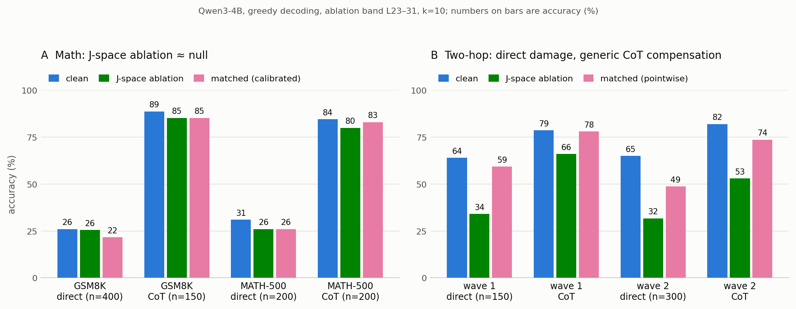

*CS 2881R Homework Zero — Qwen3-4B, GSM8K / MATH-500 / AIME 2024.
Code and frozen analyses:
[mikotohhh/cs2881r-hw0-jspace](https://github.com/mikotohhh/cs2881r-hw0-jspace).*

## 1. Hypothesis

The source paper proposes that Jacobian-lens directions form a shared internal
workspace ("J-space") used for flexible computation. Its mathematics result
suggests that written chain of thought (CoT) can partly substitute for this
internal workspace. I tested a stricter, preregistered hypothesis: **bounded
interchangeability**. CoT can externalize intermediate storage, but choosing a
difficult next step still requires internal workspace capacity. Therefore,
CoT's protection against J-space ablation should **decline as problem
difficulty increases**. The alternative was full interchangeability: protection
stays flat or grows because harder problems benefit more from externalized
reasoning.

The main predictions were that Qwen3-4B would reproduce the paper's smaller
ablation loss under CoT than under direct answering on GSM8K, and that the
relative CoT-arm loss would grow from easier to harder MATH-500 levels, with
AIME as a high-difficulty anchor. The complete hypothesis and falsifiers were
recorded before the main runs in
[`HYPOTHESIS.md`](https://github.com/mikotohhh/cs2881r-hw0-jspace/blob/main/report/HYPOTHESIS.md).

## 2. Experiment design

I used paired cells crossing answer mode (direct or CoT) with model state
(clean or J-space ablated). At every generated token, the automatic selector
chose the top *k*=10 J-lens readout tokens after excluding the clean model's
top-10 next-token IDs. For token *t* at layer *l*, the paper-raw intervention
projected the residual stream away from the direction
`v_t = J_l^T W_U[t]`. The main layer band was L23–31; the later protocol-v3
validation also tested the paper-depth mapping L19–28.

Random, same-geometry norm-matched, and early-layer interventions tested
whether accuracy changes were specific to selected J-space content rather
than generic perturbation. A two-hop factual-recall battery served as a
positive control because it requires combining two latent facts. The primary
math datasets were GSM8K, MATH-500 levels 1–5, and all 30 problems from
`HuggingFaceH4/aime_2024` (I and II). A 4,600-item fresh GSM-Symbolic follow-up
(WP16) increased precision for direct arithmetic, and a 384-item,
program-generated order-of-operations experiment (WP17) bypassed the automatic
selector by targeting token aliases of program-defined arithmetic intermediate
values. WP17 crossed two bands, masked and unmasked selection, and three
matched-control seeds.

Let `Δ_mode = accuracy(J) − accuracy(clean)`. The main estimands were this
paired accuracy change, `Δ_direct − Δ_CoT`, and the interaction between
ablation and official MATH level. Main confidence intervals used 10,000 paired
bootstrap samples. WP16 clustered by template; WP17 used 50,000 paired
cluster-bootstrap samples with equal weighting across 12 strata.

## 3. Experimental details

Experiments used Qwen3-4B in fp16 with greedy decoding. The archived main
experiment ran across two V100S GPUs; WP17 ran on the target GH200 node. The
J-lens was a third-party artifact from `neuronpedia/jacobian-lens`, fitted on
Wikitext using Anthropic's reference implementation; I did not independently
refit it. Math answers were graded by `math-verify` symbolic equivalence,
two-hop answers by entity/alias matching, and WP17 by exact integer answer.

The implementation follows the paper-raw geometry, but it is still an
operationalization rather than a guaranteed reconstruction of the paper's
instrument. In particular, the top-*k* lens readout includes final RMSNorm,
whereas the raw ablation direction does not include that norm's Jacobian. The
formal protocol-v3 battery therefore fixed a 40-item two-hop subset and tested
the literal raw operator at L19–28. This was a fixed follow-up to an exploratory
smoke test, not a blinded preregistration.

Code, frozen analyses, derived results, input hashes, and WP17's complete
aggregate formal generations are tracked in
[the repository](https://github.com/mikotohhh/cs2881r-hw0-jspace). Duplicate
per-item WP17 resume files and some archived raw generations remain local or
untracked, so the checkout should not be described as containing every file
ever emitted. Batched fp16 generation was behaviorally checked on presets, but
is not claimed to be byte-identical to sequential generation.

## 4. Experimental results

| Test | Main estimate (95% CI) | Interpretation |
|---|---:|---|
| GSM8K direct, full *n*=400 | J − clean = −0.5 pp [−4.0, +2.8] | no detectable loss |
| GSM8K direct vs CoT, shared *n*=150 | `Δ_direct − Δ_CoT` = −0.7 pp [−8.7, +7.3] | no detectable protection |
| MATH-500 direct vs CoT, *n*=200 | `Δ_direct − Δ_CoT` = −0.5 pp [−8.0, +7.0] | no detectable protection |
| MATH CoT ablation × level | β = +0.543 [+0.063, +1.022], *p*=.0265 | opposite H; misses Bonferroni .025 |
| WP16 fresh GSM-Symbolic, *n*=4,600 | J − clean = −0.52 pp [−1.65, +0.59] | equivalent within ±2 pp |
| WP17 masked L19–28, *n*=384 | oracle − clean = +0.3 pp [−1.0, +1.6] | arithmetic gate did not pass |
| v3 two-hop raw L19–28, *n*=40 | J − clean = −32.5 pp [−47.5, −17.5] | positive-control effect |

<!-- TODO: figure(s) go here, e.g.:

-->

The [main math experiment](https://github.com/mikotohhh/cs2881r-hw0-jspace/blob/main/results/main/analysis.md)
did not reproduce the predicted CoT protection.
On the shared 150 GSM8K items, direct accuracy changed by −4.0 pp
[−10.7, +2.7] and CoT by −3.3 pp [−8.7, +1.3]. On MATH-500 the changes were
−5.0 pp [−11.0, +1.0] and −4.5 pp [−10.0, +1.0]. AIME direct was at floor
(0/30 in both cells), so its direct–CoT contrast is uninterpretable; CoT fell
from 5/30 to 3/30, with truncation increasing from 13/30 to 24/30.

The MATH interaction pointed away from H, but the raw level effects were not
monotonic: −2.5, −12.5, 0.0, −7.5, and 0.0 pp for levels 1–5. The positive
log-odds interaction was driven partly by 100% clean accuracy at levels 1 and
2, and its unadjusted *p*=.0265 missed the .025 threshold for the two-test
confirmatory family. It is weak evidence against the predicted direction, not
a reversed difficulty gradient.

Controls further limit the math claim. Five of 16 registered equivalence checks
failed, including several early or matched cells, and matched perturbations
were often as harmful as J-space ablation.
[WP16](https://github.com/mikotohhh/cs2881r-hw0-jspace/blob/main/results/p9/analysis_a1.md)
then estimated J − clean at
−0.52 pp [−1.65, +0.59] and J − matched at +0.26 pp [−0.96, +1.46]; both
intervals were inside the registered ±2 pp equivalence margin. Its retention
estimate, 0.957 [0.875, 1.057], overlaps the source paper's reported
[0.802, 0.930] interval, so this is not evidence of cross-model
non-generalization.

The instrument nevertheless produced a content-specific two-hop effect. In the
[fixed v3 battery](https://github.com/mikotohhh/cs2881r-hw0-jspace/blob/main/results/v3_validation/operator_battery/results_v2.md),
raw ablation reduced accuracy by 32.5 pp
[17.5, 47.5 pp loss] relative to clean and by 23.3 pp [11.7, 35.8 pp loss]
relative to the mean of three matched controls, while sentiment and extraction
remained correct. However, CoT compensation was not J-specific: the
[independent 300-item replication](https://github.com/mikotohhh/cs2881r-hw0-jspace/blob/main/results/r1/analysis.md)
estimated
+4.3 pp [−3.0, +11.3] for J ablation and
+8.0 pp [+1.3, +14.3] for pointwise matched perturbation; their difference was
−3.7 pp [−12.0, +4.0]. The preregistered specificity claim was therefore
withdrawn.

Finally, [WP17](https://github.com/mikotohhh/cs2881r-hw0-jspace/blob/main/outputs/wp17/formal/analysis/final.md)
directly targeted arithmetic intermediate-value token aliases.
Clean accuracy was 94.0% [91.7, 96.1]. Neither masked band passed: oracle minus
clean was +0.3 pp [−1.0, +1.6] at L19–28 and 0.0 pp [−1.3, +1.3] at L23–31;
oracle-minus-matched intervals also included zero. Both unmasked diagnostics
were 0.0 pp [−1.6, +1.6]. Thus automatic-selector miss alone does not explain
the math null, but this experiment did not establish that the targeted raw
directions were causally valid arithmetic states.

## 5. Analysis of results

The bounded-interchangeability hypothesis is **not supported**. More precisely,
the math experiments did not first establish a J-specific accuracy effect that
CoT could protect against, so they cannot identify how such protection varies
with difficulty. The MATH slope points opposite the prediction but is
nonmonotonic and does not pass the preregistered multiplicity threshold. AIME
direct is unusable because of floor accuracy.

The strongest positive conclusion is narrower: the pinned Qwen3-4B,
Wikitext-lens, paper-raw setup has a validated, content-specific effect on
latent two-hop recall. Yet apparent CoT robustness on that task replicated at
least as strongly under a matched perturbation, so it does not show that text
specifically substitutes for J-space. On arithmetic, automatic selection,
high-powered GSM-Symbolic data, and oracle-targeted WP17 all returned effects
near zero. This bounds the tested procedures, but it cannot distinguish
genuinely noncausal arithmetic raw directions from an inadequate lens corpus,
selector/readout geometry, or cross-model mapping. It therefore neither
refutes the source paper nor demonstrates that Qwen3-4B mathematics is
J-space-independent.

The next high-return experiments are: (1) independently refit the same
Qwen3-4B/Wikitext lens with the pinned reference implementation and rerun only
the minimal two-hop and arithmetic causal gates; and (2) test a larger model
only after establishing an arithmetic causal positive control for its lens.
Without that construct validation, more difficulty sweeps would add precision
to an uninterpretable null rather than answer the hypothesis.
