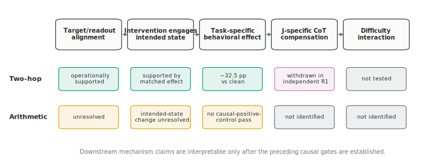

In July 2026, Anthropic's interpretability team published [*Verbalizable
Representations Form a Global Workspace in Language
Models*](https://transformer-circuits.pub/2026/workspace/index.html). The paper
makes a striking proposal: language models contain a small, privileged set of
internal representations that function like a **global workspace**. This is a
functional analogy, not a claim about subjective experience: information in
the workspace can be reported in words, deliberately manipulated, and reused
across otherwise different computations.

The authors identify these representations using the **Jacobian lens**, or
J-lens. Roughly, the lens associates directions in a model's hidden activations
with vocabulary-level concepts according to their average effect on later
verbal output. Sparse combinations of the corresponding token-indexed
directions define what the paper calls **J-space**: a changing set of concepts
the model can hold and reason with even when it has not written them down.

A concrete example makes the intervention easier to picture. Ask a model:
*"The capital of the country where the Eiffel Tower stands is …"* Answering
in one step requires an intermediate fact that never appears in the text:
**France**. The J-lens is built to detect exactly this kind of
verbalizable-but-unwritten content—at some position it might report the
concept for the token "France" as strongly active. J-space **ablation** then
deletes that content: at every generated token, it takes the ten concepts the
lens reads out most strongly (excluding the words the model is about to write
anyway) and removes the corresponding directions from the model's hidden
state across a band of layers. If the model was internally "holding"
*France*, it no longer is.

One of the paper's experiments suggests a concrete relationship between this
hidden workspace and visible chain-of-thought reasoning. Ablating J-space hurt
Claude Sonnet 4.5 much more when it answered GSM8K problems directly than when
it wrote out intermediate steps. The authors' interpretation is that writing
reasoning onto the page externalizes information the model would otherwise
have to carry internally. In that sense, a textual scratchpad may partly
substitute for a hidden workspace.

I asked two nested questions. First, does that CoT–workspace relationship
transfer to Qwen3-4B when the intervention uses a third-party J-lens fitted on
Wikitext? Second, if it does, where does the substitution stop? Written
reasoning can preserve the result of a completed step, but the model must still
decide what step to take next. I therefore preregistered the second question as
a stricter hypothesis—**bounded interchangeability**: as mathematical problems
require harder step selection, chain of thought should become less able to
protect performance from J-space ablation.

Because the model, lens, and parts of the intervention protocol differ, this
was not a literal reproduction of Anthropic's Claude experiment. It was a
cross-model stress test and construct audit. I crossed direct and written-CoT
answering with clean and J-ablated inference, added controls for generic
perturbation, and then followed the first null with increasingly targeted
causal tests.

The preregistered prediction was **not supported**, but “the Anthropic result
failed to replicate” is not the right summary. The arithmetic experiments never
established the prerequisite J-specific damage that chain of thought was
supposed to prevent. Meanwhile, the same intervention produced a large,
content-specific effect on latent two-hop recall. And an initially significant
claim that CoT specifically compensated for J-space ablation disappeared in an
independent replication.

That combination changed the project from a simple replication into a causal
audit: when an intervention gives a null result on a new model, how do we tell
the absence of a mechanism from failure to measure or manipulate it? My final
conclusion is narrower than the story I started with, but better identified:

> Under a pinned Qwen3-4B, a third-party Wikitext J-lens, and the paper's raw
> ablation geometry, I found a content-specific causal effect on latent fact chaining but no
> detectable J-specific arithmetic effect. This bounds the tested
> operationalization; it neither refutes the source paper nor shows that
> mathematics is generally independent of J-space.

This began as [CS 2881R Homework
Zero](https://boazbk.github.io/mltheoryseminar/hw0-2026/) and grew into a series
of preregistered replications, positive controls, protocol audits, and
construct-validity tests. The [code, frozen analyses, formal experiment
outputs, and manifests are collected in the project
repository](https://github.com/mikotohhh/cs2881r-hw0-jspace). *(The repository
is private until the course deadline in early August 2026; the artifact links
in this post will resolve once it becomes public.)*

## The result in thirty seconds

- **My preregistered hypothesis was not supported.** I predicted that written
  chain of thought (CoT) would become less able to compensate for J-space
  ablation as math problems became harder. But the math experiments never first
  established a J-specific accuracy loss for CoT to protect against.
- **The operator was not globally inert.** A fixed two-hop positive-control
  battery produced a large, content-specific effect while leaving sentiment and
  extraction behavior intact.
- **An attractive early mechanism claim failed independent replication.** In a
  new 300-item bank, CoT compensated a generic pointwise-matched perturbation at
  least as strongly as J-space ablation. I withdrew the claim that CoT was
  specifically substituting for J-space.
- **More precision did not turn the arithmetic null into a mechanism result.**
  A fresh 4,600-item GSM-Symbolic experiment constrained the tested effect to
  roughly ±2 points. On a compact visible-scratchpad task, an oracle-targeted
  arithmetic experiment then bypassed the automatic selector and again found
  effects near zero—but still did not prove that the targeted raw token
  directions were valid internal arithmetic states.
- **The transferable output is a method, not the null.** The
  causal-identification ladder in Figure 1—competence gate, exposure and dose
  checks, content-specific positive control, target-alignment test—is a
  reusable checklist for anyone moving an interpretability instrument to a new
  model.

## Why this matters for AI safety

Mechanistic interpretability aims to support claims about how models work and,
eventually, interventions that change their behavior for predictable reasons.
That requires more than finding a direction that correlates with a concept. The
direction must be present in the relevant computation; the intervention must
change the intended state; and the behavioral effect must be distinguishable
from generic degradation.

Those distinctions matter whenever an interpretability instrument is moved
across models. An apparent null can otherwise create false confidence that a
mechanism is absent, while a broad performance drop can be misread as a
mechanism-specific causal effect. Written reasoning raises an additional safety
question: when does text expose or replace hidden computation, and when is it
merely another output of an internal process? This project does not directly
measure CoT faithfulness or deception. Its safety relevance is methodological:
**before relying on a causal interpretability tool, establish what the tool can
and cannot identify in the model where it is being used.**

## From Anthropic's result to a falsifiable extension

The opening description compresses several distinct claims. More formally, a
J-lens maps residual-stream states into vocabulary-level concepts, and the
paper argues that sparse combinations of these verbalizable directions act as
a shared workspace used across layers for flexible computation.

Two pieces of the source paper are especially relevant here. First, its Figure
24 reports task score retained relative to the clean model under broad
ablation—for example, **0.994 retention with CoT versus 0.864 with direct
answering** at the medium intervention strength—not absolute accuracy. Second,
its arithmetic case studies use contextual activation patching or coordinate
swaps to localize and alter particular intermediate values.

Those are related but not identical claims. The benchmark result concerns
relative robustness under broad ablation; the case studies concern the causal
role of specific intermediate states. My experiments mainly use deletion—
projecting hidden states away from the lens's raw token directions—not the
paper's counterfactual coordinate swaps. They also move the method from
Claude to Qwen and use a third-party lens fitted on Wikitext. This is therefore
a **cross-model stress test and construct audit**, not a literal reproduction of
every component of the source experiment.

Two scope decisions deserve a sentence each, because a careful reader will
ask. Qwen3-4B and the three math datasets were fixed by the course
assignment. And although the third-party Wikitext lens is the most suspect
link in the causal chain, refitting a lens was outside this phase's time and
compute budget—which is exactly why an independent refit leads the next-steps
list rather than another benchmark sweep.

| Dimension | Source paper | This project |
|---|---|---|
| Model | Claude Sonnet/Opus 4.5 | Qwen3-4B |
| Lens | Model-specific lenses used by the authors | Third-party Qwen3-4B lens fitted on Wikitext |
| GSM8K quantity | Score retained relative to clean | Paired absolute accuracy change and a direct-minus-CoT contrast |
| Broad intervention | Top-10 J-space ablation | Paper-raw top-10 deletion with random, early, and matched controls |
| Arithmetic causal test | Curated patching and coordinate-swap cases | Program-scale deletion of specified numeric token directions |

I proposed a stricter extension: **bounded interchangeability**. CoT can
externalize the storage of an intermediate result, but the model must still
choose the next step internally. As problems become harder, that step-selection
computation may itself exceed the degraded workspace's capacity. If so, CoT's
protection should decline with difficulty rather than remain constant.

This prediction was motivated by a broader view of written reasoning as both
external memory and additional serial computation. Theory suggests that CoT
can increase what a fixed-depth transformer computes by writing state back into
its context ([Li et al., 2024](https://arxiv.org/abs/2402.12875)). Empirically,
its benefits appear stronger for symbolic execution than for planning the next
operation ([Sprague et al., 2024](https://arxiv.org/abs/2409.12183)), while
content-free filler provides much less help than meaningful intermediate text
on serial tasks ([Pfau et al., 2024](https://arxiv.org/abs/2404.15758)). These
results suggested a boundary between storing a completed step on the page and
choosing that step in the first place.

I recorded this hypothesis, its opposite, and its falsifiers [before the main
runs](https://github.com/mikotohhh/cs2881r-hw0-jspace/blob/58d0a2f1a253781c4d4d229a988b48fcb987f361/report/HYPOTHESIS.md).
The progression from GSM8K through MATH-500 levels 1–5 to AIME provided the
difficulty axis. The key design crossed answer mode with model state:

| | Clean model | J-space ablated |
|---|---:|---:|
| Direct answer | $A_{D,C}$ | $A_{D,J}$ |
| Written CoT | $A_{T,C}$ | $A_{T,J}$ |

For each answer mode $m$, define the paired effect

$$
\Delta_m = A_{m,J} - A_{m,C}.
$$

The registered direct-minus-CoT contrast is $\Delta_D - \Delta_T$ (*D* for
direct answering, *T* for the written-text CoT mode): **negative**
values mean that CoT loses less accuracy under ablation. Random directions, early-layer
interventions, and same-geometry matched perturbations tested whether any loss
was specific to selected J-space content rather than generic damage.

There is an important identification condition hidden inside this simple 2×2:

> **No J-specific base effect means no J-specific compensation estimand.**

If direct accuracy does not fall under J-space ablation—or falls just as much
under a content-agnostic control—then equal direct and CoT effects cannot tell
us whether text substituted for an internal workspace. This condition became
decisive almost immediately.

[](causal-ladder.svg)

*Figure 1. A downstream mechanism claim is interpretable only after its causal
prerequisites hold. With the same pinned third-party lens and audited raw
operator, the fixed positive-control battery reached a task-specific
behavioral effect for two-hop recall. Arithmetic target alignment was never
established: the oracle arithmetic experiment verified exposure and dose, but
a program-defined value does not prove that the
intended model state changed. The independent replication withdrew
J-specific CoT compensation, leaving the difficulty interaction unidentified.*

## The first null did not answer the hypothesis

The main experiment did not reproduce the expected GSM8K protection. On the
150 items shared by direct and CoT conditions, direct accuracy changed by
−4.0 points `[−10.7, +2.7]`, while CoT changed by −3.3 points
`[−8.7, +1.3]`. Their direct-minus-CoT contrast was **−0.7 points**
`[−8.7, +7.3]`—precisely estimated enough to reject a dramatic difference,
but not to distinguish modest protection from modest harm.

The larger 400-item GSM8K direct arm was even closer to zero: **−0.5 points**
`[−4.0, +2.8]`.

MATH-500 behaved similarly:

| Dataset | Direct: J − clean | CoT: J − clean | Direct − CoT effect contrast |
|---|---:|---:|---:|
| GSM8K, shared *n*=150 | −4.0 pp | −3.3 pp | −0.7 pp `[−8.7, +7.3]` |
| MATH-500, *n*=200 | −5.0 pp | −4.5 pp | −0.5 pp `[−8.0, +7.0]` |

AIME did not provide a useful hard-problem anchor. Direct accuracy was 0/30 in
both clean and ablated cells. CoT fell from 5/30 to 3/30, but ablation also
raised truncation from 13/30 to 24/30. The direct–CoT interaction is not
interpretable when one arm is at floor.

The preregistered MATH interaction pointed opposite my hypothesis: the fitted
ablation-by-level coefficient was positive, $\beta=0.543$
`[0.063, 1.022]`, with an unadjusted $p=.0265$. It would have been tempting to
announce a reversed gradient. I did not. The confirmatory threshold was .025,
and the raw effects across levels 1–5 were −2.5, −12.5, 0.0, −7.5, and 0.0
points—plainly non-monotonic. Levels 1 and 2 also began at 100% clean accuracy.
The coefficient is weak evidence against the predicted direction, not evidence
for a new law in the opposite direction.

More fundamentally, the original hypothesis had lost its prerequisite. The
math cells did not first establish content-specific J-space damage. At that
point, increasing the difficulty sweep would have refined an unidentified
interaction. I instead asked which of several explanations could account for
the null:

1. The raw operator might be incorrectly implemented or globally ineffective.
2. The dose or layer mapping might not transfer from Claude to Qwen.
3. GSM8K might be solved through memorized or shallow routes.
4. The automatic top-10 selector might rarely target mathematical states.
5. The Wikitext lens or raw token directions might not align with Qwen's
   arithmetic working representation.
6. The mechanism might genuinely not transfer to this model and task.

The remaining experiments were designed to separate these possibilities,
rather than repeatedly search for a significant math result.

## Can the intervention cause a content-specific effect at all?

The first priority was a behavioral positive control. I used two-hop questions
that require combining two latent facts—the introduction's Eiffel Tower
question is the template; another bank item is *"The capital of the country
where Machu Picchu is located is …"* (→ internally resolve *Peru*, then answer
*Lima*)—alongside sentiment and extraction tasks that should remain largely
automatic. After auditing the operator and
mapping the source paper's depth range onto Qwen, I fixed a 40-item follow-up
battery using the paper's literal raw geometry at layers 19–28.

The result was large and selective:

| Comparison on two-hop recall | Paired effect | 95% CI |
|---|---:|---:|
| J-space ablation − clean | **−32.5 pp** | `[−47.5, −17.5]` |
| J-space ablation − mean of 3 matched controls | **−23.3 pp** | `[−35.8, −11.7]` |

All sentiment and extraction items remained correct under the primary raw
intervention. Forty items buy limited precision—the intervals are wide—but
even their conservative ends are double-digit losses. The matched controls removed more residual norm on their own
trajectories, on average, yet did substantially less damage to two-hop recall.
This makes generic perturbation magnitude an implausible complete explanation
for the two-hop effect.

The result establishes something important but narrow: this pinned
model–lens–operator setup is capable of a content-specific behavioral effect on
latent fact chaining. It does **not** validate the arithmetic targets. A
microscope that resolves one tissue is not automatically calibrated for
another. The fixed battery also followed an exploratory smoke test; I describe
it as a fixed formal follow-up, not as a blinded preregistration.

In short: the intervention could bite. Whether it would bite arithmetic was
now the question.

The full operator battery and dose measurements are
[available here](https://github.com/mikotohhh/cs2881r-hw0-jspace/blob/58d0a2f1a253781c4d4d229a988b48fcb987f361/results/v3_validation/operator_battery/results_v2.md).

[](effect-forest.svg)

*Figure 2. Paired accuracy effects in percentage points; negative values mean
damage under the named treatment relative to its reference. The figure is an
evidence map across explicitly labeled protocols, not a pooled meta-analysis.
The two-hop positive control is large and content-specific, whereas the tested
math effects and their intervals cluster around zero. Intervals use each
study's registered paired procedure; the GSM-Symbolic experiment clusters by
template and has only 12.1% clean accuracy, while the AST-oracle arithmetic
experiment clusters across 12 balanced strata. Two-hop uses automatic
top-readout; the oracle rows use frozen program-derived aliases.*

## The positive result that failed replication

The two-hop task then produced the most attractive result in the project—and
the most important reason not to stop at an attractive result.

In an earlier 2×2 experiment—run under the project's earlier protocol,
before the operator audit described above—written CoT substantially
reduced the loss under J-space ablation. After adding a strict pointwise-matched control, the
estimated difference between J-space compensation and matched-perturbation
compensation was **+13.3 points** `[+3.3, +24.0]` across all 150 items. That
looked like the mechanism I had hoped to find: text specifically substituting
for damaged J-space content.

But 40 items came from the original validation battery. On the 110 entirely new
items alone, the point estimate was still positive but less decisive:
**+8.2 points** `[−3.6, +20.0]`. The result could be real, or it could be an
overestimate carried by the familiar subset. Rather than pool more similar
data, I built a new 300-item bank with no entity–relation overlap with the first
bank, stratified it to preserve the relevant trap-style questions, and froze a
criterion that explicitly required withdrawing the mechanism claim if a
generic matched perturbation compensated as strongly.

The independent replication changed the conclusion:

| Replication estimand, new *n*=300 | Estimate | 95% CI |
|---|---:|---:|
| Compensation under J-space ablation | +4.3 pp | `[−3.0, +11.3]` |
| Compensation under pointwise matched perturbation | +8.0 pp | `[+1.3, +14.3]` |
| J-space − matched compensation | **−3.7 pp** | `[−12.0, +4.0]` |

CoT still appeared to make the direct mode less fragile—but it did so at least
as strongly for the generic matched intervention. The preregistered
J-specificity claim was therefore withdrawn.

> The replication did exactly what a good replication should do: it changed my
> mind.

This does not directly contradict the source paper's GSM8K result: the model,
task, controls, and protocol differ. It overturns *my* intermediate claim about
J-specific compensation on this Qwen two-hop setup. Both the original run and
the replication used the earlier protocol; the later operator audit
independently re-certified the raw direct-mode two-hop effect, not every old
compensation contrast. Keeping those scopes separate is part of the conclusion.

The [replication hypothesis and withdrawal rule](https://github.com/mikotohhh/cs2881r-hw0-jspace/blob/58d0a2f1a253781c4d4d229a988b48fcb987f361/report/HYPOTHESIS.md#addendum-registered-2026-07-17-before-the-wave-2-replication-run)
and [frozen replication analysis](https://github.com/mikotohhh/cs2881r-hw0-jspace/blob/58d0a2f1a253781c4d4d229a988b48fcb987f361/results/r1/analysis.md)
are linked here for audit.

[](replication-forest.svg)

*Figure 3. Compensation is direct-mode loss minus CoT-mode loss; only the
J-minus-matched contrast tests J-specific substitution. Both runs use the
earlier two-hop protocol. The first run's pointwise-control follow-up was
registered after the J-space compensation result was known. On a fresh
300-item bank, the specificity estimate reversed direction and
crossed zero, triggering the registered withdrawal rule. No pooled estimate is
shown.*

## A falsification ladder for the arithmetic null

With the operator positive control established and the CoT-specificity story
weakened, I returned to arithmetic. Each follow-up targeted one explanation for
the missing effect.

### Was the intervention simply too weak?

A dose ladder expanded the ablation from the main layer band to a
heavier L15–32 band. Two-hop damage increased, so the recipe was capable of
becoming more disruptive. GSM8K J-space accuracy fell by 5.7 points—but its
matched control fell by 12.2 points. The content-specific contrast therefore
pointed in the wrong direction for a J-space mechanism. Increasing dose did not
recover a J-specific math effect.

### Was GSM8K being answered from memory?

I next used GSM-Symbolic, which instantiates familiar problem templates with
new numbers. A 400-item experiment produced only 14% clean direct accuracy,
leaving too little observation window for a useful small-effect estimate. I
treated that as a failed gate, not as evidence for or against the mechanism.

The precision follow-up enumerated 5,000 items across 100 templates. Because
the original 400 had already motivated the experiment, the primary analysis
used only the **4,600 fresh instances**, resampling templates rather than
pretending that variants of one template were independent. The result was a
tight operational null—with the key caveat stated up front rather than after
the table: the clean model itself solved only **12.1%** of fresh items, so
this bound applies to a task the model mostly fails:

| Fresh GSM-Symbolic, *n*=4,600 | Estimate | 95% cluster CI |
|---|---:|---:|
| J-space ablation − clean | **−0.52 pp** | `[−1.65, +0.59]` |
| J-space ablation − matched | **+0.26 pp** | `[−0.96, +1.46]` |

Both intervals fell inside the ±2-point equivalence margin. This
rules out a large absolute effect for this exact direct-answer protocol. It does
not rule out the source paper's result: the relative-retention interval still
overlapped the paper's medium direct band, and the experiment had no CoT arm.

#### A false positive prevented by the generation protocol

At the original 32-token cap, truncation was condition-dependent. The naive
fresh-set estimate was −1.02 points with a confidence interval just below zero.
Before looking at the final substituted contrast, I had registered a
triple-wise rule: any item truncated in any condition would be rerun in **all
three** conditions at a 128-token cap. Applying that rule moved the estimate to
−0.52 points and restored the equivalence result.

This was not cosmetic engineering. A generation cap had become a
treatment-dependent measurement process. Resume semantics, token caps, and
paired reruns were part of the statistical design.

The [fresh-set analysis, retention comparison, and cap-32
sensitivity](https://github.com/mikotohhh/cs2881r-hw0-jspace/blob/58d0a2f1a253781c4d4d229a988b48fcb987f361/results/p9/analysis_a1.md)
are reported together.

### Was the automatic selector missing mathematical intermediates?

The production intervention asked the J-lens which ten vocabulary concepts
were most active at each position, after excluding the clean model's top ten
next-token predictions. On an upstream order-of-operations bank, the correct
numeric intermediate appeared in this post-exclusion top ten on only **10.9%**
of items at L19–28 and **20.0%** at L23–31. Comparable multihop concepts ranked
higher, at 26.9% and 38.7%.

This made selector miss a plausible explanation, but not a conclusion. Rank is
not causality, and the project's original 50% targetability threshold had not
been calibrated as a necessary condition even on multihop. The useful next
experiment was not another larger selector-based benchmark. It was a task in
which the intermediate to target was specified independently of the readout.

## Bypassing selection with program-defined intermediates

The final experiment generated 384 arithmetic expressions from canonical
abstract syntax trees (ASTs). Each tree marked one intermediate whose value was
consumed by one, two, or three later operations. For example:

```text
Evaluate: 2 + 4 + (8 + (7 - 3))

oracle node: 2 + 4
oracle value: 6
eligible single-token aliases: "6", "six", " six"
final answer: 18
```

Instead of allowing the automatic top-readout to choose directions, the
intervention removed the rank-aware span of the eligible token directions for
the AST-defined value. This **oracle** is semantic: it knows the program's true
intermediate. It is not an oracle for the model's hidden representation.

The design crossed:

- four arithmetic operations and three causal-hop depths, for 12 equally
  weighted strata;
- the paper-depth band L19–28 and the original Qwen mapping L23–31;
- a masked family that preserved the clean top-10 output-token directions,
  plus an unmasked diagnostic to be triggered only if the masked family
  failed its gate;
- three same-geometry, pointwise-matched seeds per band;
- a 50,000-sample paired cluster bootstrap and an intention-to-treat analysis.

The bank, tokenizer inventory, execution gates, analyzer, and decision table
were hash-bound to [freeze commit `a21b0de`](https://github.com/mikotohhh/cs2881r-hw0-jspace/commit/a21b0decaf5fe4763fbf6b571f24f7eb41bf70b9)
before formal model generation. Clean accuracy was **94.0%**
`[91.7, 96.1]`, so the competence gate passed. Neither masked band passed the
preregistered causal-positive-control criterion, automatically triggering the
unmasked diagnostic:

| Family | Band | Oracle − clean | Oracle − matched mean |
|---|---|---:|---:|
| Masked | L19–28 | +0.3 pp `[−1.0, +1.6]` | +0.4 pp `[−0.8, +1.6]` |
| Masked | L23–31 | 0.0 pp `[−1.3, +1.3]` | +0.2 pp `[−1.1, +1.4]` |
| Unmasked | L19–28 | 0.0 pp `[−1.6, +1.6]` | +0.3 pp `[−1.1, +1.6]` |
| Unmasked | L23–31 | 0.0 pp `[−1.6, +1.6]` | +0.2 pp `[−1.3, +1.6]` |

These intervals strongly exclude the preregistered 10-point damage required
for a causal positive control. They also weaken a simple explanation in which
the automatic selector was the only problem: bypassing it did not reveal the
expected effect.

But the experiment has an equally important limit. To obtain a high clean
competence rate, it used a **compact visible scratchpad**, unlike the
forced-direct GSM-Symbolic experiment. The model could externalize or
recompute the targeted value. More fundamentally, specifying the correct AST
node does not demonstrate that Qwen encoded that value in the corresponding
raw token directions. The source paper's arithmetic cases first established
activity and used contextual patching or counterfactual swaps; this experiment
performed fixed-token deletion at scale.

The result therefore distinguishes fewer hypotheses than its precision might
suggest. It cannot tell apart:

1. the raw numeric directions are genuinely unnecessary for these arithmetic
   computations;
2. the Wikitext lens failed to learn the relevant mathematical representation;
3. the model represents values in a geometry not aligned with single-token
   aliases;
4. the chosen layer bands miss the causal state; or
5. the visible scratchpad routes around an otherwise internal dependency.

The correct conclusion is not “Qwen math does not use J-space.” It is:

> Replacing automatic selection with frozen numeric aliases did not establish
> an arithmetic causal positive control in this visible-scratchpad task.

This final experiment made the null harder to dismiss, but not broader than
the instrument it tested. The [pre-run protocol snapshot](https://github.com/mikotohhh/cs2881r-hw0-jspace/blob/a21b0decaf5fe4763fbf6b571f24f7eb41bf70b9/report/WP17_ORACLE_ARITHMETIC_PREREG_DRAFT.md),
[formal analysis](https://github.com/mikotohhh/cs2881r-hw0-jspace/blob/58d0a2f1a253781c4d4d229a988b48fcb987f361/outputs/wp17/formal/analysis/final.md),
and [released aggregate generations and manifests](https://github.com/mikotohhh/cs2881r-hw0-jspace/blob/58d0a2f1a253781c4d4d229a988b48fcb987f361/report/WP17_DATA.md)
are all available.

[](wp17-oracle.svg)

*Figure 4. The oracle arithmetic experiment replaced automatic selection with
a program-defined intermediate and eligible single-token aliases. None of the masked or unmasked
effects approached the preregistered −10-point practical-loss component of the
causal-positive-control gate; the full gate also required negative clean and
matched-control intervals. The unmasked family was a triggered diagnostic, not
a co-primary analysis. The AST supplies the correct mathematical intermediate;
it does not establish that Qwen represents the value in the deleted raw token
directions. The task used a compact visible scratchpad.*

## What survived the audit

| Claim | Status | Evidence boundary |
|---|---|---|
| The raw ablation operator can selectively alter Qwen3-4B behavior | **Supported on latent two-hop recall** | Large clean and matched-control contrasts; sentiment and extraction preserved |
| Qwen3-4B reproduces the source GSM8K CoT-protection pattern | **Not reproduced** | Direct and CoT losses were nearly equal with wide overlapping intervals |
| CoT specifically substitutes for J-space in my two-hop setup | **Withdrawn** | Independent replication found at least as much compensation for pointwise-matched damage |
| Automatic selection alone explains the arithmetic null | **Insufficient explanation** | The oracle arithmetic experiment bypassed selection and remained near zero |
| The tested raw numeric directions are necessary for the oracle-task arithmetic | **Not supported** | Four masked/unmasked estimates tightly surrounded zero |
| Qwen mathematics is generally J-space-independent | **Not established** | No arithmetic construct-validity positive control for this lens |
| The source paper is refuted | **No** | Models, lenses, tasks, estimands, and causal interventions differ |
| Bounded interchangeability declines with difficulty | **Not supported** | Its prerequisite J-specific math loss was absent |

## What I would do next

The next experiment should improve **validity**, not merely precision. Another
large GSM-Symbolic sweep with the same lens and deletion rule would estimate
the same operational quantity more precisely while leaving the central
ambiguity intact.

My next sequence would be:

1. **Refit the Qwen3-4B lens independently** with the pinned reference
   implementation, then rerun only minimal two-hop and arithmetic gates. This
   tests whether the result depends on a third-party artifact.
2. **Verify clean-trajectory alignment before intervening.** On held-out
   arithmetic items, establish that the proposed value or operation direction
   loads when the model actually computes that intermediate, rather than
   assigning the target solely from the external AST.
3. **Use a counterfactual causal intervention.** Patch a contextual state or
   swap the coordinate from the correct intermediate to a plausible incorrect
   one and test whether downstream arithmetic changes in the predicted
   direction. Deletion only tests necessity and permits recomputation; a swap
   tests content.
4. **Only then scale the question.** Once an arithmetic causal positive control
   exists for a given lens, compare direct and written-CoT modes across models
   and difficulty. A larger model should answer a scaling question, not serve
   as another search for significance.

## Reproducibility is part of the causal claim

Interventions during autoregressive generation are unusually easy to define
accidentally by implementation details. Padding, batch order, early stopping,
resume behavior, and the final unused forward pass can all change which random
control is applied or how much perturbation is accumulated. I therefore treated
execution provenance as part of the treatment definition rather than as
post-hoc housekeeping.

The released pipeline includes:

- item-, layer-, and stream-keyed random controls that are invariant to batch
  composition and padding;
- frozen tokenized-prompt hashes and no-overwrite manifests;
- explicit raw and alternative geometries rather than silent defaults;
- rank-aware fixed-token deletion with fail-closed exposure and dose checks;
- triple-wise truncation overlays and immutable resume behavior;
- paired, stratum-aware bootstrap analyses frozen before the oracle
  experiment's formal output;
- the full set of the oracle experiment's aggregate formal generations and
  manifests needed to recompute the released analysis.

Not every generation from the earlier protocol is reproducible bit-for-bit
from the current checkout, and batched fp16 execution was validated behaviorally rather than
claimed byte-identical to sequential execution. The matched controls are
pointwise norm-matched on their own trajectories, not guaranteed to have equal
aggregate dose across diverging trajectories. I report those limits because
they affect what the causal contrasts mean.

## Closing

The tempting version of this project was a clean counterclaim: *the J-space
result does not replicate in Qwen, so mathematics must use a different
mechanism*. The evidence does not support that sentence.

What it supports is more useful. The same operational setup can causally and
selectively disrupt latent fact chaining, while several increasingly targeted
arithmetic experiments remain near zero. An independent
replication also showed that an apparent CoT-specific compensation effect was
generic to matched perturbations. Together, these results locate the current
bottleneck at arithmetic construct validity and cross-model instrument
transfer—not at sample size.

Research judgment is often most visible in what one stops claiming. Here, the
most informative outcomes were not only the effects that survived, but the
experiments that forced me to withdraw a mechanism story, distinguish a precise
operational null from a theoretical refutation, and redirect the next unit of
compute toward the weakest link in the causal chain.

---

### Project artifacts

- [Repository and reproduction instructions](https://github.com/mikotohhh/cs2881r-hw0-jspace)
- [Concise course report](https://github.com/mikotohhh/cs2881r-hw0-jspace/blob/58d0a2f1a253781c4d4d229a988b48fcb987f361/report/REPORT.md)
- [Original preregistration and amendments](https://github.com/mikotohhh/cs2881r-hw0-jspace/blob/58d0a2f1a253781c4d4d229a988b48fcb987f361/report/HYPOTHESIS.md)
- [Operator protocol audit](https://github.com/mikotohhh/cs2881r-hw0-jspace/blob/58d0a2f1a253781c4d4d229a988b48fcb987f361/report/PROTOCOL_V3_AUDIT.md)
- [Independent two-hop replication](https://github.com/mikotohhh/cs2881r-hw0-jspace/blob/58d0a2f1a253781c4d4d229a988b48fcb987f361/results/r1/analysis.md)
- [Fresh 4,600-item GSM-Symbolic analysis](https://github.com/mikotohhh/cs2881r-hw0-jspace/blob/58d0a2f1a253781c4d4d229a988b48fcb987f361/results/p9/analysis_a1.md)
- [Oracle arithmetic experiment: protocol, results, and released data](https://github.com/mikotohhh/cs2881r-hw0-jspace/blob/58d0a2f1a253781c4d4d229a988b48fcb987f361/report/WP17_DATA.md)

### Role and acknowledgments

I was the project owner and scientific decision-maker. I framed the hypotheses,
chose the estimands and controls, made the go/no-go and withdrawal decisions,
implemented and audited the intervention and evaluation pipeline, ran or
supervised the experiments, reviewed the released artifacts, and take
responsibility for the claims in this account. I used AI systems as coding,
review, and drafting assistants; their outputs were checked against frozen
scripts and released artifacts, and are not represented as independent peer
review. The source J-lens implementation, third-party fitted weights, and public
datasets are credited in the repository.
